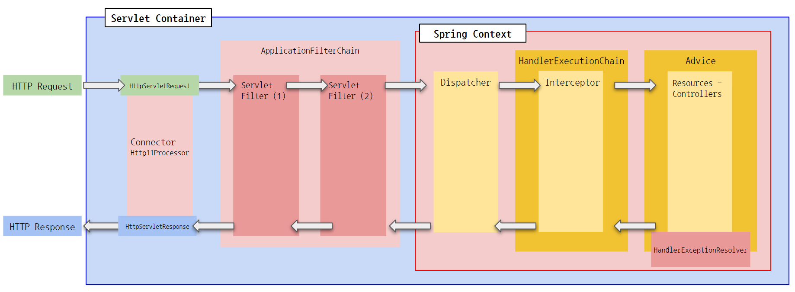
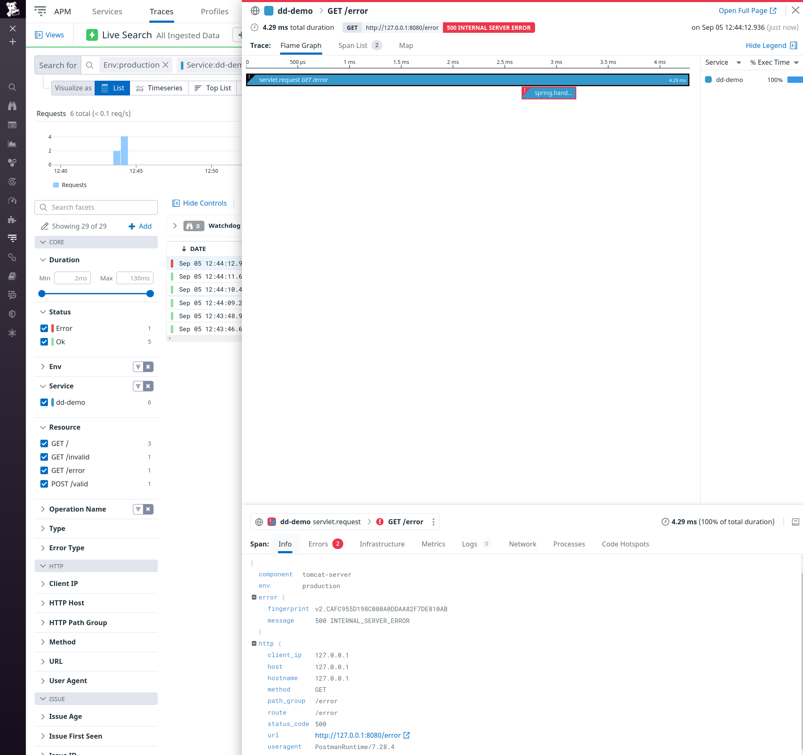

# Datadog Java Agent 테스트

## Request Lifecycle



_[원본](https://markruler.github.io/posts/java/tomcat/)_

## Datadog 에이전트 설치

- [문서](https://app.datadoghq.com/apm/docs?architecture=host-based&language=java)
- [Agent](https://docs.datadoghq.com/agent/) 설치
  - [Agent 7 Installation Instructions](https://app.datadoghq.com/account/settings#agent/fedora)

```shell
> DD_AGENT_MAJOR_VERSION=7 DD_API_KEY=${DD_API_KEY} DD_SITE="datadoghq.com" bash -c "$(curl -L https://s3.amazonaws.com/dd-agent/scripts/install_script.sh)"
> sudo systemctl status datadog-agent
Active: active (running) since Mon 2022-09-05 11:34:46 KST; 4min 34s ago
> ls -al /etc/datadog-agent
```

## Datadog Java Agent 설치

```shell
wget -O $HOME/dd-java-agent.jar 'https://dtdg.co/latest-java-tracer'
```

## 실행

### 개발 환경

```groovy
// build.gradle
bootRun {
    jvmArgs = [
            "-javaagent:/home/markruler/dd-java-agent.jar",
            "-XX:FlightRecorderOptions=stackdepth=256",
            "-Ddd.profiling.enabled=true",
            "-Ddd.logs.injection=true",
            "-Ddd.service=dd-demo",
            "-Ddd.env=production",
    ]
}
```

```shell
./gradlew clean bootRun --info
```

### 운영 환경

```shell
# Spring Project 빌드
./gradlew clean build -i

# JVM 실행
java -javaagent:$HOME/dd-java-agent.jar -Ddd.logs.injection=true -Ddd.service=dd-demo -Ddd.env=production -jar ./build/libs/dd-demo.jar
```

## Trace



- [APM - Tracing](https://docs.datadoghq.com/tracing/)
  - [Connecting Java Logs and Traces](https://docs.datadoghq.com/tracing/other_telemetry/connect_logs_and_traces/java/?tab=log4j2)
  - [Trace Pipeline - Ingestion](https://docs.datadoghq.com/tracing/trace_pipeline/)
  - [Sending Traces to Datadog](https://docs.datadoghq.com/tracing/trace_collection/)
