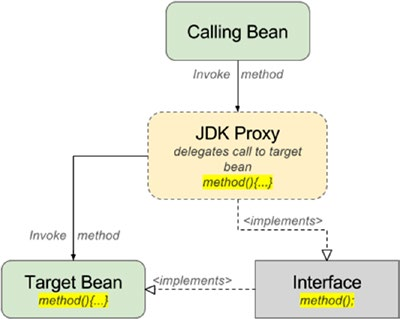
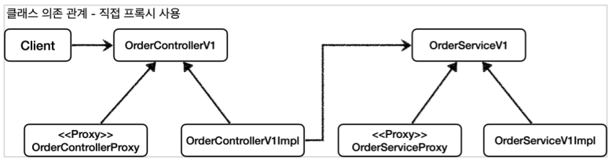
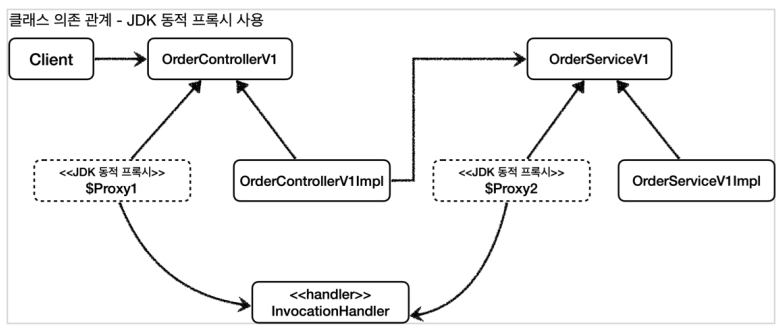
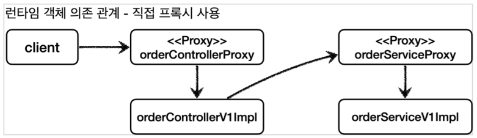
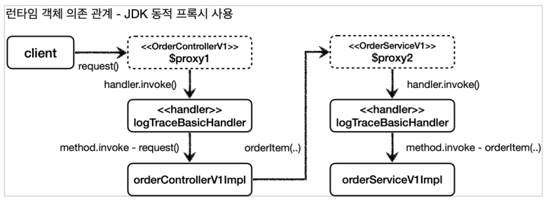
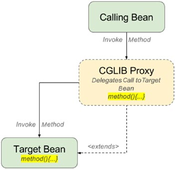
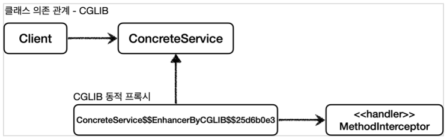
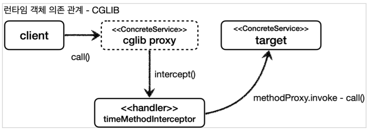
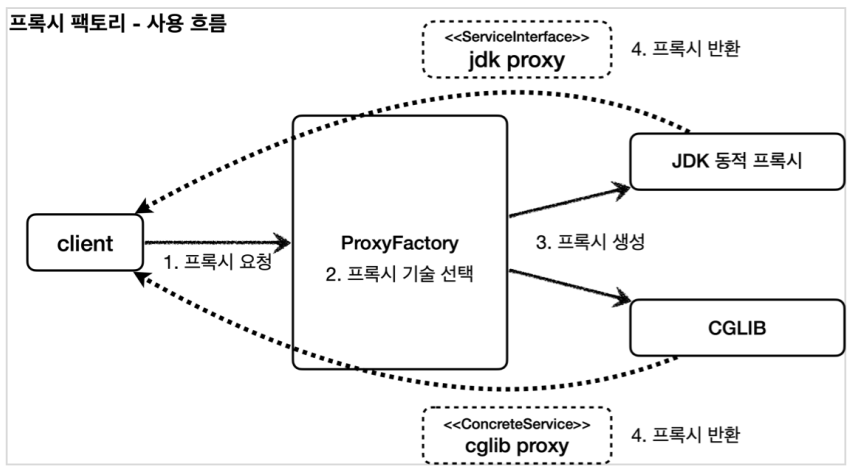
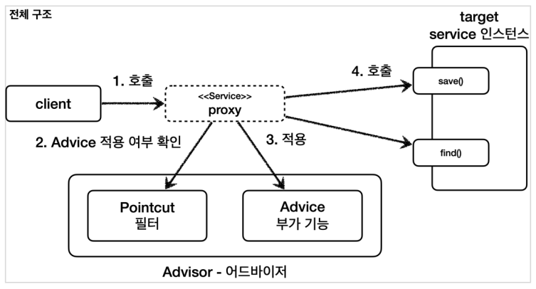

# Java Code Manipulation

- [Java Code Manipulation](#java-code-manipulation)
- [Bytecode Manipulation](#bytecode-manipulation)
  - [Use Cases](#use-cases)
  - [Libraries](#libraries)
  - [Java Agent](#java-agent)
- [Reflection](#reflection)
  - [Dependency Injection](#dependency-injection)
  - [Dynamic Proxy](#dynamic-proxy)
    - [JDK Dynamic Proxy](#jdk-dynamic-proxy)
    - [CGLib Proxy](#cglib-proxy)
    - [Spring의 ProxyFactory](#spring의-proxyfactory)
- [Annotation Processor](#annotation-processor)
  - [Lombok](#lombok)
- [참조](#참조)

# Bytecode Manipulation

Java Bytecode를 직접 조작하는 것은 Java Source Code를 변경하지 않고도 코드 변경이 필요한 경우 사용한다.

## Use Cases

- 정적 분석
  - 코드에서 버그 찾는 도구
  - 코드 복잡도 계산
- 클래스 파일 생성
  - 프록시
  - 특정 API 호출 접근 제한
  - 스칼라 같은 언어의 컴파일러
- 프로파일러 ([Datadog Agent](https://docs.datadoghq.com/tracing/setup_overview/setup/java/), New Relic)
- 최적화
- 로깅
- Spring의 Component Scan (by ASM)
  - Component를 스캔해서 Bean으로 등록할 후보 클래스 정보를 찾는데 사용한다.
  - `ClassPathScanningCandidateComponentProvider#scanCandidateComponents`: [Source](https://github.com/spring-projects/spring-framework/blob/v5.3.14/spring-context/src/main/java/org/springframework/context/annotation/ClassPathScanningCandidateComponentProvider.java#L429)
    - `SimpleMetadataReader`: [Source](https://github.com/spring-projects/spring-framework/blob/v5.3.14/spring-core/src/main/java/org/springframework/core/type/classreading/SimpleMetadataReader.java)
    - `SimpleAnnotationMetadataReadingVisitor`: [Source](https://github.com/spring-projects/spring-framework/blob/v5.3.14/spring-core/src/main/java/org/springframework/core/type/classreading/SimpleAnnotationMetadataReadingVisitor.java)

## Libraries

- [ASM](https://asm.ow2.io/)
- [Javassist](https://www.javassist.org/)
- [CGLib](https://github.com/cglib/cglib/wiki)
- [Byte Buddy](https://bytebuddy.net/#/)

## Java Agent

JVM이 제공하는 Instrumentation API를 사용하여 JVM에 로드된 기존 Bytecode를 변경한다.
Java Source Code를 직접 변경하지 않는 비침투적(Transparent)인 특정을 갖고 있다.

```bash
-javaagent:<jarpath>[=<options>]
```

- Manifest Attributes
  - 시작 시 조작하는 방식인 `Premain-Class`
  - 이미 실행 중 동적으로 조작하는 방식인 `Agent-Class`
- Use Cases
  - Datadog Agent: [instrument](https://github.com/DataDog/dd-trace-java/blob/v0.92.0/dd-java-agent/src/main/java/datadog/trace/bootstrap/AgentBootstrap.java), [manifest attributes](https://github.com/DataDog/dd-trace-java/blob/v0.92.0/dd-java-agent/dd-java-agent.gradle#L105)
  - Byte Buddy Agent: [Test code](https://github.com/raphw/byte-buddy/blob/master/byte-buddy-dep/src/test/java/net/bytebuddy/agent/builder/AgentBuilderDefaultApplicationTest.java)

# Reflection

실행 중인 Java 애플리케이션의 클래스, 인터페이스, 필드 및 메서드의 런타임 속성을 검사하거나 조작할 수 있는 기능이다.
런타임에 동작하기 때문에 컴파일 타임에 오류를 검사할 수 없다는 단점을 가진다.

Reflection은 프레임워크 개발이나 매우 일반적인 공통 로직이 필요할 때만 **주의해서 사용**해야 한다.

## Dependency Injection

런타임 중 동적으로 의존 관계를 설정하고 의존 객체를 생성할 수 있다.
런타임에 의존 관계가 설정되기 때문에 객체 간 결합도를 낮출 수 있다(Loose Coupling).

## Dynamic Proxy

프록시 패턴을 일일이 직접 구현하면 유지보수성이 떨어진다.
Real Subject가 늘어날 때마다 같이 구현해주어야 하고, Proxy가 다시 Proxy를 위임하는 등 구조가 복잡해질 수 있다.
그래서 런타임 중 동적으로 Proxy 객체를 생성하는 Dynamic Proxy 기법이 탄생하게 되었다.
즉, 동일한 기능이 필요한 대상(subject)에는 일일이 Proxy 객체를 만들 필요 없이 특정 Dynamic Proxy를 적용해주는 것이다.

JDK 자체 Dynamic Proxy는 유연성이 좋다고 볼 수 없다.
특히 인터페이스 기반의 Proxy만 지원하기 때문에 인터페이스를 반드시 구현해야 한다.
서브 클래스 기반의 Proxy를 사용하려면 바이트코드 조작 기법이 필요하다.
그래서 CGLib, Byte Buddy 등 서브 클래스를 만들 수 있는 라이브러리를 사용한다.
Spring 프레임워크를 사용할 경우 AOP를 사용한다.

- 서브 클래스 기반의 프록시를 만들어야 하는 제약에서 벗어나기 위해서는 인터페이스를 만들자.

](images/dynamic-proxy.png)

[Hands-On High Performance with Spring 5](https://www.amazon.com/Hands-High-Performance-Spring-applications/dp/1788838386)

기본적으로 Spring은 대상 오브젝트(target object)가 interface를 implement했다면 JDK dynamic proxy를 사용한다.
대상 오브젝트가 아무런 interface도 implement하지 않았다면 Spring은 CGLIB 라이브러리를 사용해서 프록시 객체를 만든다.

### JDK Dynamic Proxy

대상 오브젝트의 인터페이스를 구현한 프록시 객체를 만든다.
JDK의 `[java.lang.reflect.Proxy#newProxyInstance()](https://docs.oracle.com/javase/8/docs/api/java/lang/reflect/Proxy.html)` 를 사용한다. `com.sun.proxy.$Proxy` 접두사가 붙은 클래스가 만들어진다.
인터페이스를 구현하지 않은 클래스는 JDK Proxy 객체를 만들 수 없다.



*스프링 핵심 원리 (고급편) - 김영한*
*Pro Spring 5, `*

- 클래스 의존 관계





- 런타임 객체 의존 관계





### CGLib Proxy

클래스와 인터페이스를 모두 프록시할 수 있지만 Spring에서는 대상 오브젝트를 상속(subclassing)해서 프록시 객체를 만든다.
CGLib은 코드 생성 라이브러리(Code Generator Library)로 프록시 객체를 만들 때
CGLib의 [Enhancer](https://docs.spring.io/spring-framework/docs/5.3.13/javadoc-api/org/springframework/cglib/proxy/Enhancer.html) 클래스를 사용한다.
`$$EnhancerBySpringCGLIB$$` 접미사가 붙은 클래스가 만들어진다.
(ex: [Spring Data JPA](https://github.com/xpdojo/java/blob/c35d861c018d653efccf916e08062da753126846/docs/orm/3-spring-data-jpa.md#spring-data-jpa-%EA%B3%B5%ED%86%B5-%EC%9D%B8%ED%84%B0%ED%8E%98%EC%9D%B4%EC%8A%A4))



Pro Spring 5

- 클래스 의존 관계



스프링 핵심 원리 (고급편) - 김영한

- 런타임 객체 의존 관계



스프링 핵심 원리 (고급편) - 김영한

### Spring의 ProxyFactory

스프링에서는 `ProxyFactory`를 사용하면 Dynamic Proxy를 편리하게 생성할 수 있다.
만약 인터페이스를 구현했다면 JDK Dynamic Proxy를 생성하고,
구체 클래스(Concrete Class)라면 CGLib Proxy를 생성할 수 있다.



스프링 핵심 원리 (고급편) - 김영한

부가 기능을 구현하기 위해서는 JDK Dynamic Proxy에서 필요한 `InvocationHandler`와
CGLib에서 필요한 `MethodInterceptor`가 호출하는 `Advice`만 만들면 된다.



스프링 핵심 원리 (고급편) - 김영한

# Annotation Processor

컴파일 타임에 어노테이션들을 스캔하고 프로세싱하는 `javac`에 속한 빌드 도구다.
컴파일 단계(`RetentionPolicy.SOURCE`)에 부가적인 소스 코드를 생성하기 위한 편리한 기술이다.
런타임 중 어노테이션 처리 비용을 제거할 수 있다.

## Lombok

컴파일 타임에 Annotation Processor를 사용하여 소스 코드의 AST(Abstract Syntax Tree)를 조작한다.
공개된 API가 아닌 컴파일러 내부 클래스를 사용하여 기존 소스 코드를 조작한다.
개발자조차 hack이라고 말한다.
Eclipse에서는 Java Agent를 사용하여 Lombok으로 Eclipse 컴파일러(ECJ: Eclipse Compiler for Java)까지 조작한다.
해당 클래스들 역시 공개된 API가 아니다보니 버전 호환성에 문제가 생길 수 있다.

그럼에도 불구하고 엄청난 편리함 때문에 널리 쓰이고 있으며 대안이
몇 가지([AutoValue](https://github.com/google/auto/blob/master/value/userguide/index.md),
[Immutables](https://immutables.github.io/)) 있지만 Lombok의 모든 기능과 편의성을 대체하진 못하는 현실이다.

# 참조

- 더 자바, 코드를 조작하는 다양한 방법 - 백기선
  - [테스트](https://github.com/xpdojo/java/tree/dd7398e84e85e775d4a59b9b38df6673d0b936ea/spec/manipulation/src/test/java/com/markruler/spec)
- [스프링 핵심 원리 (고급편)](https://www.inflearn.com/course/%EC%8A%A4%ED%94%84%EB%A7%81-%ED%95%B5%EC%8B%AC-%EC%9B%90%EB%A6%AC-%EA%B3%A0%EA%B8%89%ED%8E%B8/) - 김영한
- Bytecode Manipulation
  - [Java Bytecode Crash Course](https://www.youtube.com/watch?v=e2zmmkc5xI0) - David Buck
  - [Living in the Matrix with Bytecode Manipulation](https://www.youtube.com/watch?v=39kdr1mNZ_s) - Ashley Puls, New Relic
  - ASM
    - [A Guide to Java Bytecode Manipulation with ASM](https://www.baeldung.com/java-asm) - Baeldung
  - CGLib
    - [Introduction to cglib](https://www.baeldung.com/cglib) - Baeldung
  - Byte Buddy
    - [Tutorial example test code](https://github.com/raphw/byte-buddy/blob/byte-buddy-1.12.6/byte-buddy-dep/src/test/java/net/bytebuddy/asm/AdviceTest.java)
    - [Meet Rafael Winterhalter and Byte Buddy](https://in.relation.to/2016/11/18/meet-rafael-winterhalter-and-bytebuddy/) - Vlad Mihalcea (Hibernate)
    - [Replace CGLIB by Bytebuddy](https://github.com/mockito/mockito/pull/171) - Mocktio PR
  - [Java Agent](https://docs.oracle.com/javase/9/docs/api/java/lang/instrument/package-summary.html)
    - [Guide to Java Instrumentation](https://www.baeldung.com/java-instrumentation) - Baeldung
- Reflection
  - [Using Java Reflection](https://www.oracle.com/technical-resources/articles/java/javareflection.html) - Oracle
  - [Guide to Java Reflection](https://www.baeldung.com/java-reflection) - Baeldung
  - Dynamic Proxy
    - [Dynamic Proxy Classes](https://docs.oracle.com/javase/8/docs/technotes/guides/reflection/proxy.html) - Oracle Java SE Documentation
    - [JDK Dynamic Proxy와 CGLIB의 차이점은 무엇일까?](https://gmoon92.github.io/spring/aop/2019/04/20/jdk-dynamic-proxy-and-cglib.html) - Moon
    - [Comparing Spring AOP and AspectJ](https://www.baeldung.com/spring-aop-vs-aspectj) - Baeldung
- Annotation Processor
  - [javax.annotation.processing.Processor](https://docs.oracle.com/javase/8/docs/api/javax/annotation/processing/Processor.html)
  - [Annotation Processing 101](https://hannesdorfmann.com/annotation-processing/annotationprocessing101/) - Hannes Dorfmann
    - [번역](https://medium.com/@jason_kim/annotation-processing-101-%EB%B2%88%EC%97%AD-be333c7b913)
  - [Java Annotation Processing and Creating a Builder](https://www.baeldung.com/java-annotation-processing-builder) - Baeldung
  - [All About Annotations and Annotation Processors](https://medium.com/swlh/all-about-annotations-and-annotation-processors-4af47159f29d) - Karan Dhillon
  - [Custom Annotation processors for your production code](https://www.youtube.com/watch?v=cBD4aiJ8EDo) - Jorge Castillo
  - [Lombok Execution Path](https://projectlombok.org/contributing/lombok-execution-path)
  - [Reducing Boilerplate Code with Project Lombok](http://jnb.ociweb.com/jnb/jnbJan2010.html#controversy)
  - [Google AutoService](https://www.baeldung.com/google-autoservice) - Baeldung
  - [Java Service Provider Interface (SPI)](https://itnext.io/java-service-provider-interface-understanding-it-via-code-30e1dd45a091) - Nitesh Agrawal
