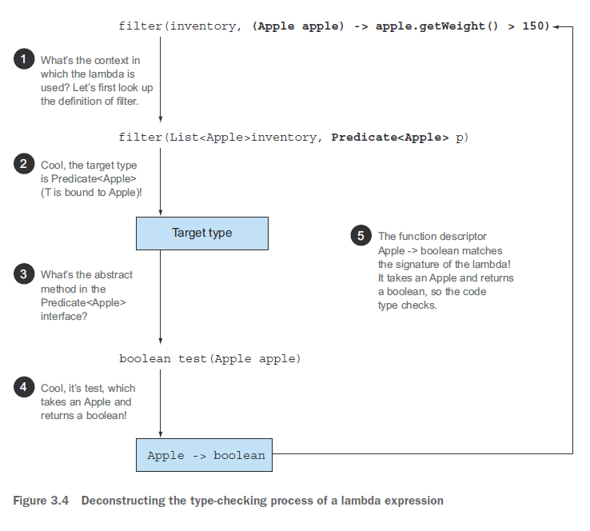
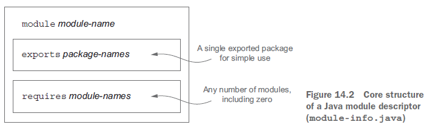

# 모던 자바 인 액션

- [모던 자바 인 액션](#모던-자바-인-액션)
- [자바 8](#자바-8)
- [동작 파라미터화](#동작-파라미터화)
  - [실전 예제](#실전-예제)
- [람다 표현식](#람다-표현식)
  - [특징](#특징)
  - [스타일](#스타일)
  - [함수형 인터페이스](#함수형-인터페이스)
  - [타입](#타입)
  - [메서드 참조 (Method Reference)](#메서드-참조-method-reference)
    - [생성자 참조 (Constructor references)](#생성자-참조-constructor-references)
- [스트림(Streams) API](#스트림streams-api)
  - [정의](#정의)
  - [특징](#특징-1)
  - [스트림 연산](#스트림-연산)
  - [스트림과 컬렉션의 차이](#스트림과-컬렉션의-차이)
  - [숫자형 스트림](#숫자형-스트림)
  - [스트림 만들기](#스트림-만들기)
- [스트림으로 데이터 수집](#스트림으로-데이터-수집)
  - [Collector](#collector)
  - [Reducing and summarizing](#reducing-and-summarizing)
  - [Grouping](#grouping)
  - [Partitioning](#partitioning)
- [병렬 데이터 처리와 성능](#병렬-데이터-처리와-성능)
- [null 대신 Optional](#null-대신-optional)
- [날짜와 시간 API](#날짜와-시간-api)
- [default 메서드](#default-메서드)
  - [추상 클래스와의 차이점](#추상-클래스와의-차이점)
  - [해석 규칙](#해석-규칙)
- [자바 9 모듈 시스템](#자바-9-모듈-시스템)
  - [추론하기 쉬운 소프트웨어](#추론하기-쉬운-소프트웨어)
    - [관심사 분리 (SoC, Separation of concerns)](#관심사-분리-soc-separation-of-concerns)
    - [정보 은닉 (Information Hiding)](#정보-은닉-information-hiding)
  - [자바 모듈 시스템을 설계한 이유](#자바-모듈-시스템을-설계한-이유)
  - [자바 모듈](#자바-모듈)
- [리액티브, 비동기](#리액티브-비동기)
- [함수형 프로그래밍](#함수형-프로그래밍)

# 자바 8

⛳자바에 포함된 함수형 프로그래밍의 핵심적인 아이디어가 있다. 메서드와 람다를 일급 값(first-class values)으로 사용하는 것이고, 다른 하나는 가변 공유 상태(mutable shared state)가 없는 병렬 실행을 이용해서 효율적이고 안전하게 함수나 메서드를 호출할 수 있다는 것이다.

# 동작 파라미터화

- 동작 파라미터화(behavior parameterization)란 아직은 어떻게 실행할 것인지 결정하지 않은 코드 블록을 의미한다. 즉, 코드 블록의 실행은 나중으로 미뤄진다.
- 코드 전달 기법을 이용하면 동작을 메서드의 인수로 전달할 수 있다. 하지만 자바 8 이전에는 코드를 지저분하게 구현해야 했다. 익명 클래스로도 어느 정도 코드를 깔끔하게 만들 수 있지만 자바 8에서는 인터페이스를 상속받아 여러 클래스를 구현해야 하는 수고를 없앨 수 있는 방법을 제공한다.
- 참 또는 거짓을 반환하는 함수를 프레디케이트(predicate)라고 한다. 자바의 `Predicate<T>` 등을 가리켜 함수형 인터페이스라고 한다.

## 실전 예제

- Comparator로 정렬하기
- Runnable로 코드 블록 실행하기
- GUI 이벤트 처리하기

# 람다 표현식

람다 표현식(Lambda expressions)은 메서드로 전달할 수 있는 익명 함수를 단순화한 것이다.

## 특징

- 익명: 보통의 메서드와 달리 이름이 없으므로 익명이라 표현한다.
- 함수: 람다는 메서드처럼 특정 클래스에 종속되지 않으므로 함수라고 부른다.
- 전달: 람다 표현식을 메서드 인수로 전달하거나 변수로 저장할 수 있다.
- 간결성: 익명 클래스처럼 많은 자질구레한 코드를 구현할 필요가 없다.

## 스타일

- 표현식 스타일(expression style) : `(parameters) -> expression`
- 블록 스타일(block style): `(parameters) -> { statements; }`

## 함수형 인터페이스

함수형 인터페이스(Functional interface)는 **하나의 추상 메서드를 지정하는 인터페이스**다. 그래서 해당 인터페이스로 동작을 파라미터화할 수 있다.

디폴트 메서드는 제외한다. 많은 디폴트 메서드가 있더라도 구현되지 않은 추상 메서드가 오직 하나면 함수형 인터페이스다.

```java
// 함수형 인터페이스다.
public interface Adder {
    int add(int a, int b);
}

// 두 추상 add 메서드를 포함하므로 함수형 인터페이스가 아니다.
public interface SmartAdder extends Adder {
    int add(double a, double b);
}

// 추상 메서드가 없으므로 함수형 인터페이스가 아니다.
public interface Nothing {
}
```

```java
// 어노테이션을 추가해서 @Override처럼 컴파일 타임에 에러를 잡을 수 있다.
@FunctionalInterface
public interface Adder {
    int add(int a, int b);
}
```

왜 함수형 인터페이스를 인수로 받는 메서드에만 람다 표현식을 사용할 수 있을까?

- 언어 설계자들은 자바에 함수 형식을 추가하는 방법도 대안으로 고려했다. 하지만 언어 설계자들은 언어를 더 복잡하게 만들지 않는 현재 방법을 선택했다.
- 대부분의 자바 프로그래머가 하나의 추상 메서드를 갖는 인터페이스(GUI 이벤트 처리 인터페이스)에 이미 익숙하다는 점도 고려했다.

함수형 인터페이스의 추상 메서드 시그니처는 람다 표현식의 시그니처를 가리킨다. 람다 표현식의 시그니처를 서술하는 메서드를 함수 디스크립터(function descriptor)라고 부른다. 다양한 람다 표현식을 사용하려면 공통의 함수 디스크립터를 기술하는 함수형 인터페이스 집합이 필요하다.

| 인터페이스 | 함수 디스크립터 | 설명 |
| --- | --- | --- |
| `Predicate<T>` | T → boolean | 제네릭 형식 T의 객체를 인수로 받아 boolean을 반환하는 추상 메서드 `test` 를 정의한다. |
| `Consumer<T>` | T → void | 제네릭 형식 T 객체를 받아서 void를 반환하는 추상 메서드 `accept` 를 정의한다. |
| `Function<T, R>` | T → R | 제네릭 형식 T 객체를 받아서 제네릭 형식 R 객체를 반환하는 추상 메서드 `apply` 를 정의한다. |
| `Supplier<T>` | () → T | 인수 없이 호출되면 제네릭 형식 T 객체를 반환하는 추상 메서드 `get` 을 정의한다. |
| `UnaryOperator<T>` | T → T | extends `Function<T, T>` |
| `BinaryOperator<T>` | (T, T) → T | extends `BiFunction<T, T, T>` |
| `BiPredicate<T, U>` | (T, U) → boolean |  |
| `BiConsumer<T, U>` | (T, U) → void |  |
| `BiFunction<T, U, R>` | (T, U) → R |  |

실행 어라운드 패턴(execute around pattern)을 람다와 활용하면 유연성과 재사용성을 추가로 얻을 수 있다. (예를 들면 자원 할당, 자원 정리 등 코드 중간에 실행해야 하는 메서드에 꼭 필요한 코드)

## 타입

- 타입 검사 (Type Checking)
  - 람다가 사용되는 컨텍스트(예를 들면 람다가 전달될 메서드 파라미터나 람다가 할당되는 변수)를 이용해서 람다의 타입을 추론할 수 있다.
  - 어떤 컨텍스트(context)에서 기대되는 람다 표현식의 타입을 대상 타입(target type)이라고 부른다.

    

- 타입 추론 (Type Inference)

    ```java
    // 형식을 추론하지 않음
    Comparator<Apple> c =
        (Apple a1, Apple a2) -> a1.getWeight().compareTo(a2.getWeight());
    
    // 형식을 추론함
    Comparator<Apple> c =
        (a1, a2) -> a1.getWeight().compareTo(a2.getWeight());
    ```

- 람다 캡처링 (Capturing lambda)
  - 익명 함수가 하는 것처럼 자유 변수 (free variable, 파라미터로 전달되는 변수가 아닌 외부에서 정의된 변수)를 활용할 수 있다.
  - 하지만 그러려면 지역 변수는 명시적으로 final로 선언되어 있어야 하거나 실질적으로 final로 선언된 변수와 똑같이 사용되어야 한다.

    ```java
    int portNumber = 1337;
    Runnable r = () -> System.out.println(portNumber); // capturing lambda
    
    portNumber = 31337; // 컴파일 에러
    ```

    - 왜 지역 변수(Local variables)에 이런 제약이 필요할까?
      외부 변수를 변화시키는 일반적인 명령형 프로그래밍 패턴(병렬화 parallelization를 방해하는 요소)에 제동을 걸 수 있다.

## 메서드 참조 (Method Reference)

- 특정 람다 표현식을 축약한 것이다.
- 가독성을 높일 수 있다.

[람다와 메서드 참조 단축 표현 예제](https://www.notion.so/5b1b4e2d931c4e56afe9c4097390ede9)

1. 정적 메서드 참조

    ```java
    // 람다
    (args) -> ClassName.staticMethod(args)
    
    // 메서드 참조
    ClassName::staticMethod
    ```

    - `Integer.parseInt()` 는 `Integer::parseInt` 로 표현할 수 있다.
2. 다양한 형식의 인스턴스 메서드 참조

    ```java
    // 람다
    (arg0, rest) -> arg0.instanceMethod(rest)
    
    // 메서드 참조
    ClassName::instanceMethod
    ```

    - `String`의 `length()` 는  `String::length` 로 표현할 수 있다.
    - `(String s) -> s.length()` : `String::length`
3. 기존 객체의 인스턴스 메서드 참조

    ```java
    // 람다
    (args) -> expr.instanceMethod(args)
    
    // 메서드 참조
    expr::instanceMethod
    ```

    - `User` 객체를 할당받은 `user` 변수가 있다면 `user::getName` 으로 표현할 수 있다.
    - `() -> user.getName()` : `user::getName`
    - 람다 표현식에서 현존하는 외부 객체의 메서드를 호출할 때 사용된다.

### 생성자 참조 (Constructor references)

```java
// Supplier<Apple> sup = new Apple();
Supplier<Apple> sup = Apple::new;
Apple apple = sup.get();

// Function<Integer, Apple> func = (weight) -> new Apple(weight);
Function<Integer, Apple> func = Apple:new;
Apple apple = func.apply(110);
```

# 스트림(Streams) API

- 스트림을 이용하면 선언형으로 컬렉션 데이터를 처리할 수 있다. 데이터를 처리하는 루프와 if 조건문 등의 제어 블록을 사용해서 어떻게 동작을 구현할지 지정할 필요 없이 '저칼로리의 요리만 선택하라' 같이 질의로 표현할 수 있다. 더 간결하고 가독성이 좋아진다.
- 동작 방식은 함수형 인터페이스로 구현해서 스트림 API에서 조립하기 때문에 유연성이 좋아진다. filter, sorted, map, collect 같은 스트림 연산은 고수준 빌딩 블록(high-level building block)으로 이루어져 있으므로 특정 스레딩 모델에 제한되지 않고 자유롭게 어떤 상황에서든 사용할 수 있다.
- 스트림을 이용하면 멀티스레드 코드를 구현하지 않아도 데이터를 투명하게 병렬로 처리할 수 있다.

## 정의

스트림이란 '데이터 처리 연산을 지원하도록 소스에서 추출된 연속된 요소'로 정의할 수 있다.

- 연속된 요소 (Sequence of elements) : 컬렉션은 자료구조이므로 컬렉션에서는 시간과 공간의 복잡성과 관련된 요소 저장 및 접근 연산ㅣ이 주를 이룬다. 반면 스트림은 filter, sorted, map처럼 표현 계산식(expressing computations)이 주를 이룬다. 즉, 컬렉션의 주제는 데이터고 스트림의 주제는 계산이다.
- 소스 (Source) : 스트림은 데이터 제공 소스로부터 데이터를 소비한다. 정렬된 소스로 스트림을 생성하면 정렬이 그대로 유지된다.
- 데이터 처리 연산 (Data-processing operations) : 스트림은 FP 언어에서 일반적으로 지원하는 연산과 데이터베이스와 비슷한 연산을 지원한다. 순차적으로 또는 병렬로 실행할 수 있다.

## 특징

- 파이프라이닝 (Pipelining) : 대부분의 스트림 연산은 스트림 연산끼리 연결해서 커다란 파이프라인을 구성할 수 있도록 스트림 자신을 반환한다. 그 덕분에 게으름(laziness), 쇼트서킷(short-circuiting) 같은 최적화도 얻을 수 있다.
- 내부 반복 (Internal iteration) : 반복자를 이용해서 명시적으로 반복하는 컬렉션과 달리 스트림은 내부 반복을 지원한다.

## 스트림 연산


```java
List<String> names =
    menu.stream()
        .filter(dish -> {
            System.out.println("filtering:" + dish.getName());
            return dish.getCalories() > 300;
        })
        .map(dish -> {
            System.out.println("mapping:" + dish.getName());
            return dish.getName();
        })
        .limit(3)
        .collect(toList());

System.out.println(names);

// Loop Fusion: filter와 map은 서로 다른 연산이지만 한 과정으로 병합
filtering:pork
mapping:pork
filtering:beef
mapping:beef
filtering:chichen
mapping:chichen
// Short Circuit: 300칼로리가 넘는 요리는 여러 개지만 오직 처음 3개만 선택
[pork, beef, chicken]
```

- 중간 연산 (intermediate operation) : 연결할 수 있는 스트림 연산으로 소스와 다른 스트림을 반환한다. 중간 연산의 중요한 특징은 최종 연산을 스트림 파이프라인에 실행하기 전까지는 아무 연산도 수행하지 않는다는 것, 즉 게으르다(lazy)는 것이다. 최종 연산과 달리 스트림의 요소를 소비(consume)하지 않는다.

    | 연산 | 파라미터 | 반환 타입 | 목적 |
    | --- | --- | --- | --- |
    | filter | `Predicate<T>` | `Stream<T>` | 람다를 인수로 받아 스트림에서 특정 요소만 선택한다. |
    | map | `Function<T, R>` | `Stream<R>` | 람다를 이용해서 한 요소를 다른 요소로 변환하거나 정보를 추출한다. |
    | flatMap | `Function<T, Stream<R>>` | `Stream<R>` | 스트림의 각 값을 다른 스트림으로 만든 다음에 모든 스트림을 하나의 스트림으로 연결하는 기능을 수행한다. |
    | sorted | `Comparator<T>` | `Stream<T>` | 정렬 |
    | distinct | - | `Stream<T>` | 각 요소의 hashCode, equals로 결정된 고유 요소로 이루어진 스트림을 반환한다. |
    | takeWhile | `Predicate<T>` | `Stream<T>` | [[Java 9](https://docs.oracle.com/javase/9/docs/api/java/util/stream/Stream.html#takeWhile-java.util.function.Predicate-) - Slicing a stream] Predicate가 처음으로 거짓이 되는 지점까지 발견된 요소를 반환한다. 이미 정렬되어 있는 무한 스트림에서 사용할 수 있다. |
    | dropWhile | `Predicate<T>` | `Stream<T>` | [[Java 9](https://docs.oracle.com/javase/9/docs/api/java/util/stream/Stream.html#dropWhile-java.util.function.Predicate-) - Slicing a stream] Predicate가 처음으로 거짓이 되는 지점까지 발견된 요소를 버린다. Predicate가 거짓이 되면 그 지점에서 작업을 중단하고 남은 모든 요소를 반환한다. 이미 정렬되어 있는 무한 스트림에서 사용할 수 있다. |
    | limit | `long` | `Stream<T>` | 정해진 개수 이상의 요소가 스트림에 저장되지 못하게 스트림 크기를 축소(truncate)한다. |
    | skip | `long` | `Stream<T>` | 처음 n개 요소를 제외한 스트림을 반환한다. |

- 최종 연산 (terminal operation) : 스트림 파이프라인에서 결과를 도출한다.

    | 연산 | 파라미터 | 반환 타입 | 목적 |
    | --- | --- | --- | --- |
    | forEach | `Consumer<T>` | `void` | 스트림의 각 요소를 소비하면서 람다를 적용한다. |
    | count | - | `long(generic)` | 스트림의 요소 개수를 반환한다. |
    | collect | `Collector<T, A, R>` | `R` | [docs] 스트림을 리듀스해서 리스트, 맵, 정수 형식의 컬렉션을 만든다. |
    | noneMatch | `Predicate<T>` | `boolean` | [short-circuiting] 모든 요소가 일치하지 않는지 확인 |
    | allMatch | `Predicate<T>` | `boolean` | [short-circuiting] 모든 요소가 일치하는지 확인 |
    | anyMatch | `Predicate<T>` | `boolean` | [short-circuiting] 적어도 한 요소와 일치하는지 확인 |
    | findFirst | - | `Optional<T>` | 현재 스트림에서 첫 번째 요소를 반환한다. |
    | findAny | - | `Optional<T>` | 현재 스트림에서 임의의 요소를 반환한다. 병렬 실행에서는 첫 번째 요소를 찾기 어렵다. 따라서 요소의 반환 순서가 상관없다면 병렬 스트림에서는 제약이 적은 findAny를 사용한다. |
    | reduce | `BinaryOperator<T>` | `Optional<T>` | [docs] 모든 스트림 요소를 처리해서 값으로 도출하는 '리듀싱 연산'을 처리한다. FP 용어로는 이 과정이 마치 종이를 작은 조각이 될 때까지 반복해서 접는 것과 비슷하다는 의미로 폴드(fold)라고 부른다. |


- 가변 누적자 패턴(mutable accumulator pattern)은 병렬화와 거리가 너무 먼 기법이다.
  - fork/join framework
  - `int sum = numbers.parallelStream().reduce(0, Integer::sum);`
- 내부 상태를 갖는 연산 (stateful operation)
  - 내부 상태의 크기가 한정적임(bounded) : reduce, sum, max, skip, limit
  - 내부 상태의 크기가 한정적이지 않음(unbounded) : distinct, sorted

## 스트림과 컬렉션의 차이

- 데이터를 언제 계산하느냐가 가장 큰 차이다. 컬렉션은 현재 자료구조가 포함하는 모든 값을 메모리에 저장하는 자료구조다. 즉, 컬렉션의 모든 요소는 컬렉션에 추가하기 전에 계산되어야 한다. 컬렉션에 요소를 추가하거나 컬렉션의 요소를 삭제할 수 있다. 반면 스트림은 이론적으로 요청할 때만 요소를 계산하는 고정된 자료구조다. 스트림에 요소를 추가하거나 스트림에서 요소를 제거할 수 없다.
- 반복자(iterator)와 마찬가지로 스트림은 한 번만 탐색할 수 있다. 탐색된 스트림의 요소는 소비된다.
- 컬렉션 인터페이스를 사용하려면 사용자가 직접 요소를 반복해야 한다. 이를 외부 반복(external iteration)이라고 한다. 반면 스트림 라이브러리는 반복을 알아서 처리하고 결과 스트림값을 어딘가에 저장해주는 내부 반복(internal iteration)을 사용한다.

## 숫자형 스트림

- Java 8에서는 Integer를 기본형(int)으로 언박싱하기 위한 비용을 줄이기 위해 기본형 특화 스트림(primitive stream specialization)을 제공한다.
  - IntStream, DoubleStream, LongStream 세 가지가 있다. (OptionalInt, OptionalDouble, OptionalLong)

    ```java
    int calories = menu.stream()
                        .mapToInt(Dish::getCalories) // IntStream 반환
                        .sum();
    ```

    - sum(), max(), min(), average() 등 다양한 유틸리티 메서드를 지원한다.
    - boxed() 메서드를 이용해서 특화 스트림을 일반 스트림으로 변환할 수 있다.

    ```java
    IntStream intStream = IntStream.rangeClosed(1, 100); // 1~100
    IntStream intStream = IntStream.range(1, 100); // 2~99
    Stream<Integer> stream = intStream.boxed();
    ```

## 스트림 만들기

- 컬렉션의 `stream()`, `parallelStream()`
- 숫자 스트림의 정적 메서드 `range()`, `rangeClosed()`
- `Stream<String> stream = Stream.of("Modern", "Java", "In ", "Action");`
- `int sum = Arrays.stream(numbers).sum();`
- `Stream<String> lines = Files.linmes(Paths.get("data.txt"), Charset.defaultCharset());`
- 무한 스트림(infinite stream, unbounded stream)
  - `String.iterate(0, n -> n + 1)`
  - `Stream.generate(Math::random)` : iterate와 달리 생상된 각 값을 연속적으로 계산하지 않는다.

# 스트림으로 데이터 수집

> Collector 인터페이스

## Collector

다수준(multi-level)으로 그룹화를 수행할 때 명령형 프로그래밍과 함수형 프로그래밍의 차이점이 더욱 두드러진다. 명령형 코드에서는 문제를 해결하는 과정에서 다중 루프와 조건문을 추가하며 가독성과 유지보수성이 크게 떨어진다.

`Collector` 인터페이스는 리듀싱 연산(collectors)들을 어떻게 구현할지 제공하는 메서드 집합으로 구성된다.

```java
// T는 수집될 스트림 항목의 제네릭 타입이다.
// A는 누적자, 즉 수집 과정에서 중간 결과를 누적하는 객체의 타입이다.
// R은 수집 연산 결과 객체의 타입이다.
public interface Collector<T, A, R> {
    Supplier<A> supplier(); // 새로운 결과 컨테이너 만들기
    BiConsumer<A, T> accumulator(); // 결과 컨테이너에 요소 추가하기
    Function<A, R> finisher(); // 최종 변환값을 결과 컨테이너로 적용하기
    BinaryOperator<A> combiner(); // 두 결과 컨테이너 병합
    Set<Characteristics> characteristics(); // 컬렉터의 연산을 정의
}
```

## Reducing and summarizing

## Grouping

## Partitioning

# 병렬 데이터 처리와 성능

- 병렬 스트림
  - `Stream.parallel()`
  - `parallelStream()`
- fork/join framework

  

- `Spliterator` : 분할할 수 있는 반복자(splitable iterator) 인터페이스

# null 대신 Optional

- 하스켈, 스칼라 등의 함수형 언어는 선택형 값(optional value)을 저장할 수 있는 타입을 제공한다.
- 자바 8에서는 NPE를 피할 수 있도록 도와주는 `Optional<T>` 클래스를 제공한다. '선택형 값' 개념의 영향을 받은 `Optional<T>`는 값을 갖거나 갖지 않을 수 있는 값의 존재나 부재 여부를 표현하는 컨테이너 객체다.
- 자바 언어 아키텍트인 브라이언 고츠(Brian Goetz)는 `Optional` 의 용도가 선택형 반환값을 지원하는 것이라고 명확하게 못박았다. `Optional` 클래스는 필드 형식으로 사용할 것을 가정하지 않았으므로 `Serializable` 인터페이스를 구현하지 않는다. 따라서 도메인 모델에 `Optional` 을 사용한다면 직렬화 모델을 사용하는 도구나 프레임워크에서 문제가 생길 수 있다. 다음처럼 `Optional` 로 값을 반환받을 수 있는 메서드를 추가하는 방식을 권장한다.

    ```java
    public class Person {
        private Car car;
    
        public Optional<Car> getCarAsOptional() {
            return Optional.ofNullable(car);
        }
    }
    ```

# 날짜와 시간 API

- `java.time`
  - `LocalDate`
  - `LocalTime`
  - `LocalDateTime`
  - `Instant`
  - `Duration`
  - `Period`
- `java.time.format.DataTimeFormatter`
- `java.time.temporal.TemporalAdjusters`

# default 메서드

- 인터페이스를 구현하는 클래스는 인터페이스에서 정의하는 모든 메서드 구현을 제공하거나 아니면 슈퍼클래스의 구현을 상속받아야 한다.
  - 인터페이스를 바꾸고 싶을 때는 인터페이스를 구현한 클래스의 구현도 고쳐야 하기 때문에 문제가 발생한다.
  - 이 문제를 해결하기 위해 인터페이스에 기본 구현을 포함시킬 수 있는 방법을 제공한다.
- 자바 8에서 **호환성을 유지하면서 API를 바꿀 수 있도록** 기본 구현을 포함하는 인터페이스를 정의하는 두 가지 방법을 제공한다.
  - 정적 메서드(static method) : 클래스에서 사용하는 것과 마찬가지로 인스턴스 변수로 사용하지 못한다. 자바 8 이후에는 유틸리티 클래스가 아닌 인터페이스에 정적 메서드를 구현하자. 그러면 private 생성자나 예외를 던지는 생성자 따위를 만들 필요가 없다.
  - 디폴트 메서드(default method) : 해당 인터페이스를 구현한 클래스의 인스턴스를 생성한 후 상속받은 디폴트 메서드를 호출해서 사용할 수 있다.

    ```java
    // sort는 List 인터페이스의 디폴트 메서드다.
    default void sort(Comparator<? super E> c) {
        Collections.sort(this, c);
    }
    
    List<Integer> numbers = Arrays.asList(3, 5, 1, 2, 6);
    // naturalOrder()는 Comparator 인터페이스의 정적 메서드다.
    numbers.sort(Comparator.naturalOrder());
    ```


- [호환성](https://docs.oracle.com/javase/specs/jls/se7/html/jls-13.html)
  - 바이너리 호환성 (Binary Compatibility) : 뭔가를 바꾼 이후에도 에러 없이 기존 바이너리가 실행될 수 있는 상황을 말한다. 예를 들어 인터페이스에 메서드를 추가했을 때 추가된 메서드를 호출하지 않는 한 문제가 일어나지 않는데 이를 바이너리 호환서이라고 한다.
  - 소스 호환성 (Source Compatibility) : 코드를 고쳐도 기존 프로그램을 성공적으로 재컴파일할 수 있음을 의미한다. 예를 들어 인터페이스에 메서드를 추가하면 소스 호환성이 아니다. 추가한 메서드를 구현하도록 클래스를 고쳐야 하기 때문이다.
  - 동작 호환성 (Behavioral Compatibility) : 코드를 바꾼 다음에도 같은 입력값이 주어지면 프로그램이 같은 동작을 실행한다는 의미다.

## 추상 클래스와의 차이점

- 클래스는 하나의 추상 클래스만 상속받을 수 있지만, 인터페이스는 여러 개 구현할 수 있다.
- 추상 클래스는 인스턴스 변수(필드)로 공통 상태를 가질 수 있다. 하지만 인터페이스는 인스턴스 변수를 가질 수 없다.

## 해석 규칙

- C++의 다이아몬드 문제와 같은 다중상속 문제가 발생할까? 자바 8은 다른 클래스나 인터페이스로부터 같은 시그니처를 갖는 메서드를 상속받을 때 세 가지 규칙을 따른다.
  - 클래스가 항상 이긴다. 클래스나 슈퍼클래스에서 정의한 메서드가 디폴트 메서드보다 우선권을 갖는다.
  - 1번 규칙 이외의 상황에서는 서브인터페이스가 이긴다. 즉, 인터페이스 B가 인터페이스 A를 상속받는다면 B가 이긴다.
  - 여전히 디폴트 메서드의 우선순위가 결정되지 않았다면 여러 인터페이스를 상속받는 클래스가 명시적으로 디폴트 메서드를 오버라이드하고 호출해야 한다.

# 자바 9 모듈 시스템

> The Java Module System - Nicolai Parlog (Manning, 2019) 읽기

## 추론하기 쉬운 소프트웨어

### 관심사 분리 (SoC, Separation of concerns)

컴퓨터 프로그램을 고유의 기능으로 나누는 동작을 권장하는 원칙이다.

자바 9 모듈은 '자바 패키지'와 달리 클래스가 어떤 다른 클래스를 볼 수 있는지를 컴파일 타임에 정교하게 제어할 수 있다.

### 정보 은닉 (Information Hiding)

세부 구현을 숨기도록 장려하는 원칙이다.

## 자바 모듈 시스템을 설계한 이유

- 자바 9 이전에는 각각의 기능을 담당하는 패키지, 클래스, 인터페이스로 모듈화를 구현했는데 효과적인 캡슐화를 달성하기에는 역부족이었다.
- 클래스 경로 지옥 문제는 애플리케이션의 의존성을 추론하기 더욱 어렵게 만들었다.
- 자바 9 이전의 JDK는 거대했으며 높은 유지 비용과 진화를 방해하는 문제가 존재했다.

## 자바 모듈

- 모듈은 `module` 이라는 새 키워드에 이름과 바디를 추가해서 정의한다. 기술적으로 `module` , `requires` , `export` 같은 자바 9의 모듈 관련 용어는 제한된 키워드(restricted keyword)다. 따라서 하위 버전 호환성을 이유로 이들 식별자를 프로그램의 원하는 곳에 자유롭게 사용할 수 있지만 모듈이 허용된 곳에서는 이들 용어가 키워드로 해석된다.
- 모듈 디스크립터(module descriptor)는 `module-info.java` 라는 특별한 파일에 저장된다. 엄밀하게 따지면 텍스트 형식을 모듈 선언(module declaration)이라고 하고 `module-info.class` 에 저장된 바이너리 형식을 모듈 디스크립터라 한다. `module-info.java` 파일은 `src/main/java` 디렉터리에 위치해야 한다.

    

# 리액티브, 비동기

- TODO

# 함수형 프로그래밍

- TODO
