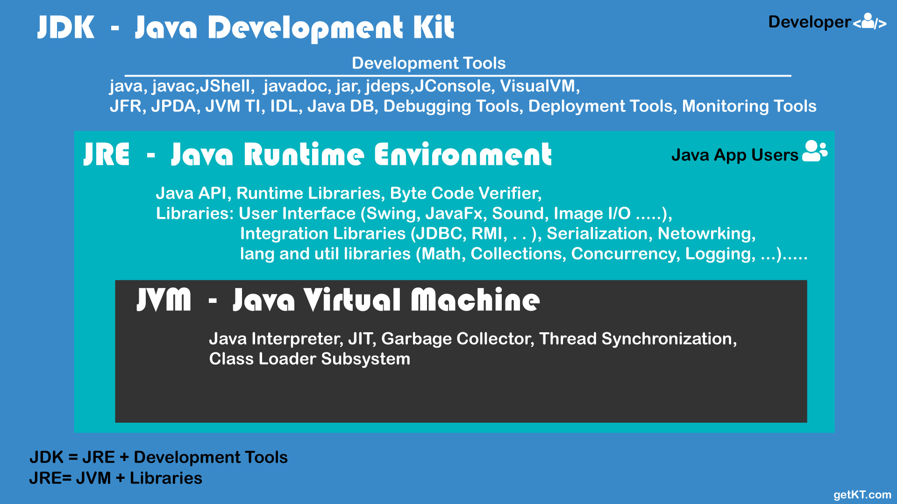
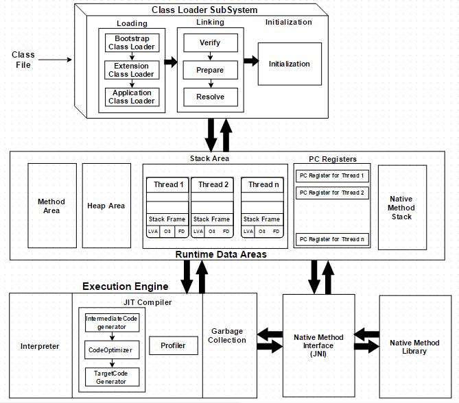
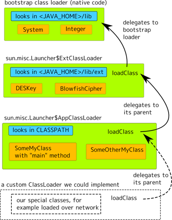

# JVM 이해하기

- [JVM 이해하기](#jvm-이해하기)
  - [참조](#참조)
  - [JVM, JRE, JDK](#jvm-jre-jdk)
    - [JDK: Java Development Kit](#jdk-java-development-kit)
    - [JRE: Java Runtime Environment](#jre-java-runtime-environment)
    - [JVM](#jvm)
  - [JVM의 특징](#jvm의-특징)
  - [JVM Components](#jvm-components)
    - [Class Loader](#class-loader)
      - [특징](#특징)
      - [클래스 로더 종류](#클래스-로더-종류)
      - [로드 과정](#로드-과정)
    - [Runtime Data Areas](#runtime-data-areas)
      - [PC Register](#pc-register)
      - [JVM Stack](#jvm-stack)
        - [Frame](#frame)
      - [Heap](#heap)
      - [Method Area](#method-area)
        - [런타임 상수 풀 (Runtime Constant Pool)](#런타임-상수-풀-runtime-constant-pool)
      - [Native Method Stack](#native-method-stack)
    - [Execution Engine](#execution-engine)
      - [Interpreter](#interpreter)
      - [JIT(Just-In-Time) Compiler](#jitjust-in-time-compiler)
      - [GC: Garbage Collector](#gc-garbage-collector)
    - [JNI: Java Native Interface](#jni-java-native-interface)
      - [Native Method Library](#native-method-library)
  - [Hands on](#hands-on)
    - [JDK 설치](#jdk-설치)
    - [JDK 도구](#jdk-도구)
    - [Java Compiler](#java-compiler)

## 참조

- [The Java® Virtual Machine Specification - Java SE 8 Edition](https://docs.oracle.com/javase/specs/jvms/se8/html/index.html) - Tim Lindholm, Frank Yellin, Gilad Bracha, Alex Buckley
- [JVM Internal](http://blog.jamesdbloom.com/JVMInternals.html) - James Bloom
- [Java Code To Byte Code](https://blog.jamesdbloom.com/JavaCodeToByteCode_PartOne.html) - James Bloom
- [JVM Internal](https://d2.naver.com/helloworld/1230) - 박세훈
- [자바 최적화 (Optimizing Java)](https://www.aladin.co.kr/shop/wproduct.aspx?isbn=9791162241776) - 벤저민 J. 에번스, 제임스 고프, 크리스 뉴랜드
- [더 자바, 코드를 조작하는 다양한 방법](https://www.inflearn.com/course/the-java-code-manipulation/) - 백기선
- [A Simple Java Native Interface (JNI) example in Java and Scala](https://schlining.medium.com/a-simple-java-native-interface-jni-example-in-java-and-scala-68fdafe76f5f) - Brian Schlining
- [Java Classloaders](https://analyzejava.wordpress.com/category/core-java/java-classloaders/) - Arpit Khandelwal
- [The basics of Java class loaders](https://www.infoworld.com/article/2077260/learn-java-the-basics-of-java-class-loaders.html) - InfoWorld
- [OpenJDK source code](https://github.com/openjdk/jdk)
  - [physical stack frame](https://github.com/openjdk/jdk/blob/jdk-11%2B28/src/hotspot/share/runtime/frame.hpp#L50)
  - [heap region type](https://github.com/openjdk/jdk/blob/jdk-11%2B28/src/hotspot/share/gc/g1/heapRegionType.hpp#L33)
- [JVM Internals](https://blogs.oracle.com/javamagazine/category/jm-jvm-internals) - Oracle Blogs
  - [How the JVM Locates, Loads, and Runs Libraries](https://blogs.oracle.com/javamagazine/post/how-the-jvm-locates-loads-and-runs-libraries) - Oleg Šelajev
  - [Java Magazine](https://bitbucket.org/javamagazine/magdownloads/downloads/)
- [Codecache Tuning](https://docs.oracle.com/javase/8/embedded/develop-apps-platforms/codecache.htm) - Oracle
  - [Introduction to JVM Code Cache](https://www.baeldung.com/jvm-code-cache) - Baeldung
- [The Java HotSpot VM](https://ethz.ch/content/dam/ethz/special-interest/infk/inst-cs/lst-dam/documents/Education/Classes/Spring2018/210_Compiler_Design/Slides/2018-Compiler-Design-Guest-Talk.pdf) - Tobias Hartmann
- [The Java HotSpot Performance Engine Architecture](https://www.oracle.com/java/technologies/whitepaper.html) - Oracle
- [자바 최적화](https://www.aladin.co.kr/shop/wproduct.aspx?ISBN=9791162241776) - 벤저민 J. 에번스,제임스 고프,크리스 뉴랜드

## JVM, JRE, JDK



_출처: [Difference between JDK, JRE and JVM explained - getKT](https://getkt.com/blog/difference-between-jdk-jre-and-jvm-explained-java/)_

### JDK: Java Development Kit

- JRE에 [개발 도구(tools)](https://docs.oracle.com/javase/8/docs/technotes/tools/)를 포함한다.

### JRE: Java Runtime Environment

- 자바 애플리케이션을 실행할 수 있는 최소한의 실행 환경이다.
- JVM과 Java 핵심 라이브러리들이 포함된다.
- [JDK and JRE File Structure](https://docs.oracle.com/javase/8/docs/technotes/tools/unix/jdkfiles.html) - Oracle

### JVM



_출처: [The JVM Architecture Explained](https://dzone.com/articles/jvm-architecture-explained) - DZone_

- 가상 머신(Virtual Machine)이란 물리 머신의 논리적 구현체라 할 수 있다.
- JVM(Java Virtual Machine)은 자바 바이트코드를 해석하고 실행하는 가상 머신이다.
- 자바는 원래 WORA(Write Once Run Anywhere)를 구현하기 위해 물리적인 머신과 별개의 가상 머신을 기반으로 동작하도록 설계되었다.
- 클래스 로더(Class Loader)가 컴파일된 자바 바이트코드(class file)를 런타임 데이터 영역(Runtime Data Areas)==메모리 영역에 로드하고,
  실행 엔진(Execution Engine)이 자바 바이트코드를 OS에 특화된 기계어로 변환하여 실행한다.
  - JVM 자체는 플랫폼에 종속적이지만, Java 언어를 플랫폼에 독립적으로 만들어준다.

## JVM의 특징

_출처: [JVM Internal](https://d2.naver.com/helloworld/1230) - Naver D2_

- 스택 기반의 가상 머신
  - 대표적인 컴퓨터 아키텍처인 인텔 x86 아키텍처나 ARM 아키텍처와 같은 하드웨어는 레지스터 기반으로 동작한다.
  - 그에 비해 JVM은 스택 기반으로 동작한다.
- 심볼릭 레퍼런스
  - 기본 자료형(primitive data type)을 제외한 모든 타입(클래스와 인터페이스)을 명시적인 메모리 주소 기반의 레퍼런스가 아니라 심볼릭 레퍼런스를 통해 참조한다.
- 가비지 컬렉션(garbage collection)
  - 클래스 인스턴스는 사용자 코드에 의해 명시적으로 생성되고 가비지 컬렉션에 의해 자동으로 파괴된다.
- 기본 자료형을 명확하게 정의하여 플랫폼 독립성 보장
  - C/C++ 등의 전통적인 언어는 플랫폼에 따라 int 형의 크기가 변한다.
  - JVM은 기본 자료형을 명확하게 정의하여 호환성을 유지하고 플랫폼 독립성을 보장한다.
- 네트워크 바이트 오더(network byte order)
  - 자바 클래스 파일은 네트워크 바이트 오더를 사용한다.
  - 인텔 x86 아키텍처가 사용하는 리틀 엔디안이나, RISC 계열 아키텍처가 주로 사용하는 빅 엔디안 사이에서 플랫폼 독립성을 유지하려면 고정된 바이트 오더를 유지해야 하므로 네트워크 전송 시에 사용하는 바이트 오더인 네트워크 바이트 오더를 사용한다.
  - 네트워크 바이트 오더는 빅 엔디안이다.

## JVM Components

### Class Loader

JVM의 클래스 로더는 동적 로드를 담당하는 부분이다.
자바의 동적 로드는 Compile time이 아니라 Runtime에 클래스를 처음으로 참조할 때
해당 클래스를 Load하고 Link한다.

클래스 로더가 클래스 로드를 요청받으면, 클래스 로더 캐시, 상위 클래스 로더, 자기 자신의 순서로 해당 클래스가 있는지 확인한다.
즉, 이전에 로드된 클래스인지 클래스 로더 캐시를 확인하고, 없으면 상위 클래스 로더를 거슬러 올라가며 확인한다.
Bootstrap Class Loader까지 확인해도 없으면 요청받은 클래스 로더가 파일 시스템에서 해당 클래스를 찾는다.

#### 특징

- 계층 구조
  - 클래스 로더끼리 부모-자식 관계를 이루어 계층 구조로 생성된다.
  - 최상위 클래스 로더는 Bootstrap Class Loader다.
- 위임 모델
  - 계층 구조를 바탕으로 클래스 로더끼리 로드를 위임하는 구조로 동작한다.
  - 클래스를 로드할 때 먼저 상위 클래스 로더를 확인하여 상위 클래스 로더에 있다면 해당 클래스를 사용하고, 없다면 로드를 요청받은 클래스 로더가 클래스를 로드한다.
- 가시성(visibility) 제한
  - 하위 클래스 로더는 상위 클래스 로더의 클래스를 찾을 수 있지만, 상위 클래스 로더는 하위 클래스 로더의 클래스를 찾을 수 없다.
- 언로드 불가
  - 클래스 로더는 클래스를 로드할 수는 있지만 언로드할 수는 없다.
  - 언로드 대신, 현재 클래스 로더를 삭제하고 아예 새로운 클래스 로더를 생성하는 방법을 사용할 수 있다.

#### 클래스 로더 종류



_출처: [WHAT IS A CLASSLOADER? - Arpit Khandelwal](https://analyzejava.wordpress.com/2014/09/25/java-classloader-what-is-a-classloader/)_

- Bootstrap Class Loader
  - JVM을 기동할 때 생성되며, Object 클래스를 비롯하여 자바 API들을 로드한다.
  - 다른 클래스 로더와 달리 자바가 아니라 네이티브 코드로 구현되어 있다.
  - `jre/lib/rt.jar`
- Extension Class Loader
  - 기본 자바 API를 제외한 확장 클래스들을 로드한다.
  - 다양한 보안 확장 기능 등을 여기에서 로드한다.
  - `jre/lib/ext` 폴더나 `java.ext.dirs` 환경변수에 지정된 경로를 참조한다.
- System Class Loader
  - Bootstrap Class Loader와 Extension Class Loader가 JVM 자체의 구성 요소들을 로드하는 것이라면, System Class Loader는 애플리케이션의 클래스들을 로드한다고 할 수 있다.
  - 사용자가 지정한 `$CLASSPATH` 내의 클래스들을 로드한다.
- User-Defined Class Loader
  - 애플리케이션 사용자가 직접 코드 상에서 생성해서 사용하는 클래스 로더다.

#### 로드 과정

- [Loading](https://docs.oracle.com/javase/specs/jvms/se8/html/jvms-5.html#jvms-5.3)
  - 클래스를 파일에서 가져와서 JVM의 메모리에 로드한다.
- [Linking](https://docs.oracle.com/javase/specs/jvms/se8/html/jvms-5.html#jvms-5.4)
  - [Verification](https://docs.oracle.com/javase/specs/jvms/se8/html/jvms-5.html#jvms-5.4.1)
    - 읽어 들인 클래스가 자바 언어 명세(Java Language Specification) 및 JVM 명세에 명시된 대로 잘 구성되어 있는지 검사한다.
    - 클래스 로드의 전 과정 중에서 가장 까다로운 검사를 수행하는 과정으로서 가장 복잡하고 시간이 많이 걸린다.
    - JVM [TCK](https://en.wikipedia.org/wiki/Technology_Compatibility_Kit)의 테스트 케이스 중에서
      가장 많은 부분이 잘못된 클래스를 로드하여 정상적으로 검증 오류를 발생시키는지 테스트하는 부분이다.
  - [Preparation](https://docs.oracle.com/javase/specs/jvms/se8/html/jvms-5.html#jvms-5.4.2)
    - 클래스가 필요로 하는 메모리를 할당한다.
    - 클래스에서 정의된 필드, 메서드, 인터페이스들을 나타내는 데이터 구조를 준비한다.
  - [Resolution](https://docs.oracle.com/javase/specs/jvms/se8/html/jvms-5.html#jvms-5.4.3)
    - 클래스의 Constant Pool 내 모든 심볼릭 레퍼런스를 다이렉트 레퍼런스로 변경한다.
- [Initialization](https://docs.oracle.com/javase/specs/jvms/se8/html/jvms-5.html#jvms-5.5)
  - 클래스 변수들을 적절한 값으로 초기화한다.
  - 즉, static initializer들을 수행하고, static 필드들을 설정된 값으로 초기화한다.

### Runtime Data Areas


_출처: [JVM Internal](https://d2.naver.com/helloworld/1230) - Naver D2_

JVM이라는 프로그램이 운영체제 위에서 실행되면서 할당받는 **메모리 영역**이다.
런타임 데이터 영역은 6개의 영역으로 나눌 수 있다.
PC 레지스터(PC Register), JVM 스택(JVM Stack), 네이티브 메서드 스택(Native Method Stack)은 스레드마다 하나씩 생성되며
힙(Heap), 메서드 영역(Method Area), 런타임 상수 풀(Runtime Constant Pool)은 모든 스레드가 공유해서 사용한다.

#### PC Register

- [Oracle Docs](https://docs.oracle.com/javase/specs/jvms/se8/html/jvms-2.html#jvms-2.5.1)
- PC(Program Counter) 레지스터는 각 스레드마다 하나씩 존재하며 스레드가 시작될 때 생성된다.
- PC 레지스터는 현재 수행 중인 JVM 명령의 주소를 갖는다.

#### JVM Stack

- [Oracle Docs](https://docs.oracle.com/javase/specs/jvms/se8/html/jvms-2.html#jvms-2.5.2)
- JVM 스택은 각 JVM 스레드마다 하나씩 존재하며 스레드가 시작될 때 생성된다.
- 스택 프레임(Stack Frame)이라는 구조체를 저장하는 스택으로, JVM은 오직 JVM 스택에 스택 프레임을 추가하고(push) 제거하는(pop) 동작만 수행한다.
- 예외 발생 시 printStackTrace() 등의 메서드로 보여주는 Stack Trace의 각 라인은 하나의 스택 프레임을 표현한다.
- 스택 프레임(Stack Frame)
  - JVM 내에서 메서드가 수행될 때마다 하나의 스택 프레임이 생성되어 해당 스레드의 JVM 스택에 추가되고 메서드가 종료되면 스택 프레임이 제거된다.
    각 스택 프레임은 지역 변수 배열(Local Variable Array), 피연산자 스택(Operand Stack), 현재 실행 중인 메서드가 속한 클래스의 런타임 상수 풀에 대한 레퍼런스를 갖는다.
  - 지역 변수 배열, 피연산자 스택의 크기는 컴파일할 때 결정되기 때문에 스택 프레임의 크기도 메서드에 따라 크기가 고정된다.
  - 지역 변수 배열(Local Variable Array)
    - 0부터 시작하는 인덱스를 가진 배열이다.
    - 0은 메서드가 속한 클래스 인스턴스의 this 레퍼런스다.
    - 1부터는 메서드에 전달된 파라미터들이 저장되며, 메서드 파라미터 이후에는 메서드의 지역 변수들이 저장된다.
  - 피연산자 스택(Operand Stack)
    - 메서드의 실제 작업 공간이다.
    - 각 메서드는 피연산자 스택과 지역 변수 배열 사이에서 데이터를 교환하고, 다른 메서드 호출 결과를 추가하거나(push) 꺼낸다(pop).
    - 피연산자 스택 공간이 얼마나 필요한지는 컴파일할 때 결정할 수 있으므로, 피연산자 스택의 크기도 컴파일할 때 결정된다.
- 스레드의 계산 작업(computation)에 허용된 것보다 더 큰 JVM Stack이 필요한 경우
  JVM은 `StackOverflowError` 를 발생시킨다.
- 새로운 스레드의 초기 JVM 스택을 생성하는 데 사용할 수 있는 메모리가 충분하지 않거나
  JVM 스택을 동적으로 확장하는 데 사용할 수 있는 메모리가 충분하지 않은 경우
  JVM은 `OutOfMemoryError` 를 발생시킨다.

##### Frame

- 메서드가 호출될 때마다 새 프레임이 생성된다.
- 메서드 호출이 완료되면 정상적으로 완료되든 캐치되지 않은 예외가 던져져서 갑작스러운 완료가 되든 파괴된다.
- JVM 스택에 할당된다.
- 고유의 지역 변수 배열, 고유의 피연산자 스택, 런타임 상수 풀에 대한 레퍼런스

#### Heap

- [Oracle Docs](https://docs.oracle.com/javase/specs/jvms/se8/html/jvms-2.html#jvms-2.5.3)
- **인스턴스 또는 객체**를 저장하는 공간으로 **가비지 컬렉션 대상**이다.
- JVM 성능 등의 이슈에서 가장 많이 언급되는 공간이다.
- 힙 구성 방식이나 가비지 컬렉션 방법 등은 JVM 벤더의 재량이다.
- 하나의 물리 머신에서 여러 개의 Java 애플리케이션이 실행 중이라면
  각 애플리케이션마다 `java` 명령어를 통해 JVM이 실행 중이라는 뜻이고, 힙 영역 또한 각 JVM마다 하나씩 독립적으로 존재한다.
- ASM(automatic storage management)에서 사용할 수 있는 것보다 더 많은 Heap이 필요한 경우
  JVM은 `OutOfMemoryError` 를 발생시킨다.

#### Method Area

- [Oracle Docs](https://docs.oracle.com/javase/specs/jvms/se8/html/jvms-2.html#jvms-2.5.4)
- 메서드 영역은 모든 스레드가 공유하는 영역으로 JVM이 시작될 때 생성된다.
- JVM이 읽어 들인 **각각의 클래스와 인터페이스에 대한 런타임 상수 풀, 필드와 메서드 정보, static 변수, 메서드의 바이트코드 등**을 보관한다.
- 메서드 영역은 JVM 벤더마다 다양한 형태로 구현할 수 있으며, 오라클 핫스팟 JVM(HotSpot JVM)에서는 흔히 Permanent Area, 혹은 Permanent Generation(PermGen)이라고 부른다.
- 메서드 영역에 대한 가비지 컬렉션은 JVM 벤더의 선택 사항이다.
- Method Area가 더 이상 메모리를 할당 받을 수 없는 경우
  JVM은 `OutOfMemoryError` 를 발생시킨다.

##### 런타임 상수 풀 (Runtime Constant Pool)

- [Oracle Docs](https://docs.oracle.com/javase/specs/jvms/se8/html/jvms-2.html#jvms-2.5.5)
- 클래스 파일 포맷에서 `constant_pool` 테이블에 해당하는 영역이다.
- **Method Area에 포함되는 영역**이긴 하지만, JVM 동작에서 가장 핵심적인 역할을 수행하는 곳이기 때문에 JVM 명세에서도 따로 중요하게 기술한다.
- 각 클래스와 인터페이스의 상수뿐만 아니라, 메서드와 필드에 대한 모든 레퍼런스까지 담고 있는 테이블이다.
- 즉, 어떤 메서드나 필드를 참조할 때 JVM은 런타임 상수 풀을 통해 해당 메서드나 필드의 실제 메모리상 주소를 찾아서 참조한다.
- 클래스 또는 인터페이스를 생성할 때 런타임 상수 풀의 구성에
  JVM의 **Method Area**에서 사용할 수 있는 것보다 더 많은 메모리가 필요한 경우
  JVM은 `OutOfMemoryError` 를 발생시킨다.

#### Native Method Stack

- [Oracle Docs](https://docs.oracle.com/javase/specs/jvms/se8/html/jvms-2.html#jvms-2.5.6)
- **자바 외의 언어로 작성된 네이티브 코드**를 위한 스택이다.
- 즉, JNI(Java Native Interface)를 통해 호출하는 C/C++ 등의 코드를 수행하기 위한 스택으로,
  언어에 맞게 C 스택이나 C++ 스택이 생성된다.
- 스레드의 계산 작업(computation)에 허용된 것보다 더 큰 JVM Stack이 필요한 경우
  JVM은 `StackOverflowError` 를 발생시킨다.
- 새로운 스레드의 초기 Native Method 스택을 생성하는 데 사용할 수 있는 메모리가 충분하지 않거나
  Native Method 스택을 동적으로 확장하는 데 사용할 수 있는 메모리가 충분하지 않은 경우
  JVM은 `OutOfMemoryError` 를 발생시킨다.

### Execution Engine

클래스 로더를 통해 JVM 내의 런타임 데이터 영역에 배치된 바이트코드는 실행 엔진에 의해 실행된다.
실행 엔진은 자바 바이트코드를 명령어 단위로 읽어서 실행한다.
CPU가 기계 명령어(ISA)를 하나씩 실행하는 것과 비슷하다.
그런데 자바 바이트코드는 기계가 바로 수행할 수 있는 언어보다는 비교적 인간이 보기 편한 형태로 기술된 것이다.
그래서 실행 엔진은 이와 같은 바이트코드를 실제로 JVM 내부에서
인터프리터 방식이나 JIT 컴파일러 방식으로 기계가 실행할 수 있는 형태로 변경한다.

#### Interpreter

- 바이트코드 명령어를 하나씩 읽어서 해석하고 실행한다.
- 하나씩 해석하고 실행하기 때문에 바이트코드 하나하나의 해석은 빠른 대신
  인터프리팅 결과의 실행은 느리다는 단점을 가지고 있다.
  흔히 얘기하는 인터프리터 언어의 단점을 그대로 가지는 것이다.
- 즉, 바이트코드라는 '언어'는 기본적으로 인터프리터 방식으로 동작한다.

#### JIT(Just-In-Time) Compiler

- 인터프리터의 단점을 보완하기 위해 도입된 것이 JIT 컴파일러다.
- 인터프리터 방식으로 실행하다가 적절한 시점에 바이트코드 전체를 컴파일하여 네이티브 코드로 변경하고,
  이후에는 해당 메서드를 더 이상 인터프리팅하지 않고 네이티브 코드로 직접 실행하는 방식이다.
- 네이티브 코드를 실행하는 것이 하나씩 인터프리팅하는 것보다 빠르고,
  네이티브 코드는 캐시에 보관되기 때문에 한 번 컴파일된 코드는 계속 빠르게 수행된다.

#### GC: Garbage Collector

Heap의 클래스 인스턴스는 사용자 코드에 의해 명시적으로 생성되고
더 이상 참조되지 않는 인스턴스는 가비지 컬렉션에 의해 자동으로 파괴된다.
[더 보기](garbage-collector.md)

### JNI: Java Native Interface

Java 애플리케이션에서 C, C++로 작성된 함수를 사용할 수 있도록 한다.
`native` 키워드를 사용해서 메서드를 호출할 수 있다.

#### Native Method Library

C, C++로 작성된 라이브러리다.

## Hands on

### JDK 설치

- [sdkman](https://sdkman.io) 활용

```bash
curl -s "https://get.sdkman.io" | bash
# fish에선 올바르게 동작하지 않습니다.
source "$HOME/.sdkman/bin/sdkman-init.sh"
sdk version
# SDKMAN 5.11.0+644
```

```bash
sdk help
sdk list java
sdk install java 11.0.11-open
```

```bash
java -version
# openjdk 11.0.11 2021-04-20
# OpenJDK Runtime Environment 18.9 (build 11.0.11+9)
# OpenJDK 64-Bit Server VM 18.9 (build 11.0.11+9, mixed mode)
```

### [JDK 도구](https://docs.oracle.com/javase/8/docs/technotes/tools/index.html)

- `java` 명령어는 Java 애플리케이션을 실행합니다.
  즉, JVM을 실행합니다.

```bash
java -XX:+PrintCommandLineFlags -version
# [...] -XX:+UseG1GC
```

- [jps](https://docs.oracle.com/javase/8/docs/technotes/tools/unix/jps.html)
  명령어는 JVM에서 실행 중인 Java 애플리케이션의 PID를 조회한다.

```bash
jps
```

- [jcmd](https://docs.oracle.com/javase/8/docs/technotes/guides/troubleshoot/tooldescr006.html)
  명령어는 실행 중인 JVM에 진단 명령을 요청한다.

```bash
# JVM 및 JDK 버전을 출력한다.
jcmd ${JAVA_APP_PID} VM.version

# JVM에 설정된 모든 시스템 속성을 출력한다.
jcmd ${JAVA_APP_PID} VM.system_properties

# JVM에 사용된 플래그를 출력한다.
jcmd ${JAVA_APP_PID} VM.flags

# 클래스 히스토그램을 출력한다.
jcmd ${JAVA_APP_PID} GC.class_histogram

# 스택 추적으로 모든 스레드를 출력한다.
jcmd ${JAVA_APP_PID} Thread.print
```

### Java Compiler

- `javac`
- 자바 컴파일러는 JVM의 요소가 아니라 개발 도구다.
- 자바 컴파일러는 C/C++ 등의 컴파일러처럼 고수준 언어를 기계어, 즉 직접적인 CPU 명령으로 변환하는 것이 아니라, 개발자가 이해하는 자바 언어를 JVM이 이해하는 자바 바이트코드로 번역한다.
