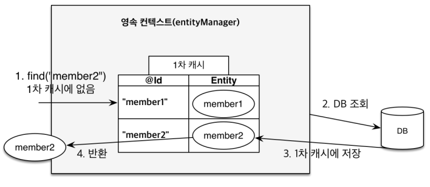

# 자바 ORM 표준 - JPA

- [자바 ORM 표준 - JPA](#자바-orm-표준---jpa)
- [참조](#참조)
- [ORM: Object-relational mapping](#orm-object-relational-mapping)
- [JPA: Java Persistence API](#jpa-java-persistence-api)
  - [주요 인터페이스](#주요-인터페이스)
  - [Hibernate: 대표적인 JPA 구현체](#hibernate-대표적인-jpa-구현체)
  - [엔터티의 생명주기](#엔터티의-생명주기)
  - [JPQL: **Java Persistence Query Language**](#jpql-java-persistence-query-language)
- [🧐️JPA를 써야 하는 이유](#️jpa를-써야-하는-이유)
- [영속성 관리 - 내부 동작 방식](#영속성-관리---내부-동작-방식)
  - [영속성 컨텍스트 (Persistence Context)](#영속성-컨텍스트-persistence-context)
  - [플러시 (Flush)](#플러시-flush)
    - [플러시하는 방법 3가지](#플러시하는-방법-3가지)
- [Entity 매핑](#entity-매핑)
  - [hibernate.hbm2ddl.auto](#hibernatehbm2ddlauto)
  - [Object to Table](#object-to-table)
  - [Field to Column](#field-to-column)
  - [Id to PrimaryKey](#id-to-primarykey)
    - [권장하는 식별자 전략](#권장하는-식별자-전략)
- [연관관계 매핑 기초](#연관관계-매핑-기초)
  - [연관관계가 필요한 이유](#연관관계가-필요한-이유)
  - [단방향 연관관계 (Uni-directional Relationship)](#단방향-연관관계-uni-directional-relationship)
  - [양방향 연관관계 (Bi-directional Relationship)](#양방향-연관관계-bi-directional-relationship)
    - [🧐️연관관계의 주인](#️연관관계의-주인)
- [다양한 연관관계 매핑](#다양한-연관관계-매핑)
  - [다대일 (N:1)](#다대일-n1)
  - [일대다 (1:N)](#일대다-1n)
  - [일대일 (1:1)](#일대일-11)
  - [다대다 (N:M)](#다대다-nm)
  - [상속관계 매핑](#상속관계-매핑)
  - [Mapped Superclass](#mapped-superclass)
- [프록시와 연관관계 관리](#프록시와-연관관계-관리)
  - [프록시(Proxy)](#프록시proxy)
    - [프록시 특징](#프록시-특징)
  - [즉시 로딩(Eager)과 지연 로딩(Lazy)](#즉시-로딩eager과-지연-로딩lazy)
  - [영속성 전이 (CASCADE)](#영속성-전이-cascade)
  - [고아 객체 (ORPHAN)](#고아-객체-orphan)
  - [Cascade와 같이 사용하기](#cascade와-같이-사용하기)
- [🧐️값 타입](#️값-타입)
  - [주의할 점](#주의할-점)
  - [기본 값 타입](#기본-값-타입)
  - [임베디드 타입 (embedded type)](#임베디드-타입-embedded-type)
  - [값 타입과 불변 객체](#값-타입과-불변-객체)
  - [값 타입의 비교](#값-타입의-비교)
  - [값 타입 컬렉션 (Value Type Collection)](#값-타입-컬렉션-value-type-collection)

# 참조

- [자바 ORM 표준 JPA 프로그래밍 (기본편)](https://www.inflearn.com/course/ORM-JPA-Basic/dashboard) - 김영한
  - [동명의 책](https://www.aladin.co.kr/shop/wproduct.aspx?ISBN=9788960777330)
- [Database Access (JPA)](https://terasolunaorg.github.io/guideline/5.0.2.RELEASE/en/index.html) - TERASOLUNA
- [The JPA and Hibernate second-level cache](https://vladmihalcea.com/jpa-hibernate-second-level-cache/) - Vlad Mihalcea
- [Fetching a DTO with a To-Many Association](https://thorben-janssen.com/fetching-dtos-with-to-many-association/) -
- [Hibernate Second-Level Cache](https://www.baeldung.com/hibernate-second-level-cache) - Baeldung

# ORM: Object-relational mapping

ORM은 말그대로 객체와 관계형 DB를 매핑한다는 뜻이다. 객체는 객체대로 설계하고, 관계형 DB는 관계형 DB대로 설계할 수 있도록 ORM 프레임워크가 중간에서 매핑해준다.

객체와 테이블을 매핑해서 생기는 패러다임의 불일치 문제를 개발자 대신 ORM 프레임워크가 해결해준다. 예를 들어 ORM 프레임워크를 사용하면 객체를 데이터베이스에 저장할 때 SQL을 직접 작성하는 것이 아니라 객체를 마치 자바 컬렉션에 저장하듯이 ORM 프레임워크에 저장하면 된다. 그러면 ORM 프레임워크가 적절한 SQL을 생성해서 데이터베이스 객체를 저장해준다.

객체 측면에서는 정교한 객체 모델링을 할 수 있고, RDB는 데이터베이스에 맞도록 모델링하면 된다. 그리고 둘을 어떻게 매핑해야 하는지 ORM 프레임워크에게 알려주면 된다. 덕분에 개발자는 데이터 중심 관계형 데이터베이스를 사용해도 객체지향 애플리케이션 개발에 집중할 수 있게 된다.

# JPA: Java Persistence API

JPA는 자바 진영의 ORM 기술 표준 API다. API란 말 그대로 JPA는 인터페이스일 뿐 구현체는 (주로) Hibernate를 사용한다. 참고로 Hibernate는 자바 표준이 아니다.


_JPA와의 상호작용 (출처: 자바 ORM 표준 JPA 프로그래밍 - 김영한)_


_JPA 구동 방식 (출처: 자바 ORM 표준 JPA 프로그래밍 - 김영한)_


_출처: [Java Persistence API Architecture](http://openjpa.apache.org/builds/1.2.1/apache-openjpa-1.2.1/docs/manual/jpa_overview_arch.html) - Apache OpenJPA User's Guide_

## 주요 인터페이스

| 인터페이스           | 설명                                                                                                           |
| -------------------- | -------------------------------------------------------------------------------------------------------------- |
| EntityManagerFactory | EntityManager를 생성한다. Factory는 하나만 생성해서 애플리케이션 전체에서 공유해야 한다.                       |
| EntityManager        | CRUD를 포함해 엔터티와 관련된 모든 일을 처리하는 관리자. 쓰레드 간 공유하지 않는다. 사용하고 바로 버려야 한다. |
| EntityTransaction    | JPA의 모든 데이터 변경은 트랜잭션 안에서만 수행된다.                                                           |
| PersistenceContext   | 엔터티를 영구 저장하는 환경. 엔터티 매니저는 persist() 메서드를 사용해 엔터티를 영속성 컨텍스트에 저장한다.    |

## Hibernate: 대표적인 JPA 구현체

OOP 언어에는 대부분 ORM 프레임워크가 있다. 성숙도에 따라 단순히 CRUD 기능만 제공하는 것부터 대부분의 패러다임 불일치 문제를 해결해주는 ORM 프레임워크도 있다. 자바 진영에서도 다양한 프레임워크가 있는데 그 중 하이버네이트(Hibernate)가 가장 성숙한 ORM 프레임워크다.


_출처: [Hibernate Architecture](https://howtodoinjava.com/hibernate-tutorials/) - HowToDoInJava_

## 엔터티의 생명주기

- 비영속(new/transient) : 영속성 컨텍스트와 전혀 관계가 없는 **새로운** 상태
- 영속(managed) : 영속성 컨텍스트에 **관리되는** 상태
  - `em.persist(entity)`
- 준영속(detached) : 영속성 컨텍스트에 **저장되었다가 분리된** 상태
  - `em.detach(entity)` : 특정 엔터티만 준영속 상태로 전환
  - `em.clear()` : 영속성 컨텍스트를 완전히 초기화
  - `em.close()` : 영속성 컨텍스트를 종료
- 삭제(removed) : **삭제된** 상태
  - `em.remove(entity)`


출처: [High-Performance Java Persistence](https://www.amazon.com/High-Performance-Java-Persistence-Vlad-Mihalcea/dp/973022823X) - Vlad Mihalcea


출처: [Entity Lifecycle Management - Apache OpenJPA Docs](https://openjpa.apache.org/builds/3.1.0/apache-openjpa/docs/jpa_overview_em_lifecycle.html)

## JPQL: **Java Persistence Query Language**

- SQL을 추상화한 객체 지향 쿼리 언어
  - SQL은 DBMS 테이블을 대상으로 쿼리
  - JPQL은 Entity 객체를 대상으로 쿼리. 특정 DB SQL 문법에 의존하지 않는다.

# 🧐️JPA를 써야 하는 이유

> 자바 ORM 표준 JPA 프로그래밍 - 김영한
>
> - 책 (p32)
> - 인프런 강의 (SQL 중심적인 개발의 문제점, JPA 소개)

- 개발자가 반복적인 코드와 SQL을 추가로 작성하지 않아도 되기 때문에 **생산성**이 향상된다. 아래와 같은 인터페이스를 이미 제공한다.
  - 저장: jpa.persist(entity)
  - 조회: Entity entity = jpa.find(entityId)
  - 수정: entity.setName("변경할 이름")
  - 삭제: jpa.remove(entity)
- "**데이터 중심"과 "객체 중심" 사이의 패러다임 불일치 문제를 해결**해서 개발자가 객체지향 프로그래밍에 집중할 수 있게 해준다.
  - 관계형 데이터베이스 : 데이터를 정규화해서 저장하는 것이 목적
  - 객체지향 프로그래밍 : 책임을 할당해서 캡슐화하는 것이 목적
- 성능 최적화 기능
  - 1차 캐시를 사용해서 동일성 보장
    - 같은 트랜잭션 안에서는 동일한 엔터티를 반환한다. 조회 성능을 조금이나마 향상시킬 수 있다.
    - DB Isolation Level이 `Read Commit`이어도 DB가 아닌 애플리케이션 레이어에서 `Repeatable Read`를 보장한다. (1차 캐시에서 반환된 엔터티 객체는 `==`으로 비교해도 같은 엔터티로 판단함)

      

      _1차 캐시에 찾는 엔터티가 있을 경우_

      

      _1차 캐시에 찾는 엔터티가 없을 경우_

  - 트랜잭션을 지원하는 쓰기 지연 (Transactional Write-behind)
    - 트랜잭션을 커밋할 때까지 [JDBC Batching](https://docs.jboss.org/hibernate/orm/5.6/userguide/html_single/Hibernate_User_Guide.html#batch)을 사용해서 SQL을 한번에 전송(flush)한다.
    - UDPATE, DELETE - 트랜잭션을 커밋할 때까지 DB 로우 락(Row-level Lock)이 걸리지 않는다.
  - 변경 감지 (Dirty Checking)
    - 엔터티와 스냅샷을 비교해서 다를 경우 수정된 엔터티를 쓰기 지연 SQL 저장소에 등록한다. 그 후 flush 한다.

      

  - 지연 로딩(Lazy Loading)은 객체가 실제로 사용될 때 조회한다. 반면에 즉시 로딩(Eager Loading)은 JOIN SQL로 연관된 객체까지 미리 조회한다. JPA에서는 두 가지가 모두 가능하다. 실무에서는 Lazy Loading을 기본적으로 사용하다가 성능 향상이 필요한 경우에만 Eager Loading을 사용한다.

    ```java
    // Lazy Loading
    Member member = memberDAO.find(memberId); // SELECT * FROM MEMBER;
    Team team = member.getTream(); // SELECT * FROM TEAM
    String teamName = team.getName();

    // Eager Loading
    Member member = memberDAO.find(memberId); // SELECT * FROM MEMBER JOIN TEAM;
    Team team = member.getTream();
    String teamName = team.getName();
    ```

- 엔터티 필드가 추가되면 SQL도 전부 수정해야 하지만 JPA를 사용하면 Entity만 수정하면 JPA가 대신 처리해주므로 **유지보수**해야 하는 코드 수가 줄어든다.

  ```java
  // JPA Entity
  class Member {
    private String memberId;
    private String name;
    private Stream tel; // 추가하면 끝
  }

  // SQL 중심 매핑에서는 관련된 SQL에 전부 추가해야 한다.
  INSERT INTO MEMBER(MEMBER_ID, NAME, **TEL**) VALUES (?, ?, ?)
  SELECT MEMBER_ID, NAME, **TEL** FROM MEMBER
  UDPATE MEMBER SET **TEL** = ?
  ```

- 신뢰할 수 있는 엔터티, 계층

  ```java
  // SQL 중심 매핑
  class MemberService {
    public void process() {
      Member member = memberDAO.find(memberId);
      // SQL에서 team, order를 조회하지 않았을 수도 있다.
      // NPE 발생할 수 있기 때문에 결국 직접 SQL을 확인해야 한다.
      member.getTeam();
      member.getOrder().getDelivery();
    }
  }

  // JPA
  class MemberService {
    public void process() {
      Member member = memberDAO.find(memberId);
      member.getTeam(); // lazy loading
      member.getOrder().getDelivery(); // lazy loading
    }
  }
  ```

- 애플리케이션이 특정 RDBMS 벤더에 종속되지 않도록 데이터 접근 추상화 계층(Dialect)을 제공해서 **독립성**을 보장한다.
  - 예를 들어, Oracle의 ROWNUM은 다른 DBMS에서 쓰이지 않는 문법이지만 JPA에서 Dialect에 따라 자동으로 생성해준다.
- JPA는 자바 진영의 ORM 기술 **표준**이다. 표준을 사용하면 다른 구현 기술로 손쉽게 변경할 수 있다.

# 영속성 관리 - 내부 동작 방식

## 영속성 컨텍스트 (Persistence Context)

영속성 컨텐스트란 **엔터티를 영구 저장하는 환경**이다. 엔터티 매니저를 통해 엔터티를 저장하거나 조회하면 엔터티 매니저는 영속성 컨텍스트에 엔터티를 보관하고 관리한다.

## 플러시 (Flush)

JPA는 보통 트랜잭션을 커밋하는 순간 영속성 컨텍스트에 새로 저장된 엔터티 또는 변경된 엔터티를 데이터베이스에 한꺼번에 반영하는데 이를 플러시(flush)한다고 한다.

- 플러시는 **영속성 컨텍스트를 비우지 않는다**.
- 영속성 컨텍스트의 **변경 내용**을 DB에 **동기화**시키는 작업이다.
- 트랜잭션이라는 작업 단위가 중요하다. 커밋 직전까지만 동기화하면 된다.

### 플러시하는 방법 3가지

- `em.flush()`를 통해 직접 호출
- 트랜잭션 커밋(`tx.commit()`) - 플러시 자동 호출
- JPQL 쿼리 실행 - 플러시 자동 호출

# Entity 매핑

## hibernate.hbm2ddl.auto

- [Hibernate Docs](https://docs.jboss.org/hibernate/orm/5.2/userguide/html_single/Hibernate_User_Guide.html#configurations-hbmddl)
- 운영 장비에는 절대 `create`, `create-drop`, `update`를 사용하면 안된다.
- 개발 초기 단계는 `create` 또는 `update`
- 테스트 서버는 `update` 또는 `validate`
- 스테이징과 운영 서버는 `validate`을 사용하거나 아예 사용하지 않는다.

| 옵션                         | 설명                                                                       |
| ---------------------------- | -------------------------------------------------------------------------- |
| create                       | 기존 테이블 삭제 후 다시 생성(DROP 후 CREATE), 종료 시점에는 DROP하지 않음 |
| create-drop                  | create와 같으나 종료 시점에 테이블 DROP                                    |
| update                       | 변경분만 반영 (운영 DB에는 사용하면 안됨)                                  |
| validate                     | 엔터티와 테이블이 정상 매핑되었는지만 확인                                 |
| 이 외의 값 (ex: none, never) | 매핑되는 옵션이 없으므로 사용되지 않음                                     |

## Object to Table

- `@Entity` 어노테이션이 붙은 클래스는 JPA가 관리하는 엔터티 객체가 된다.
  - JPA를 사용해서 테이블과 매핑할 클래스는 `@Entity` 어노테이션이 필수로 있어야 한다.
  - 내부적으로 리플렉션, 프록시 등의 기술을 사용하기 때문에 동적으로 객체를 생성하기 위해서는 기본 생성자(파라미터가 없는 public, protected 생성자)가 반드시 있어야 한다.
  - final, enum, interface, inner 클래스를 사용할 수 없다.
  - 저장할 필드에 final 키워드를 사용할 수 없다.
- `@Table` 어노테이션은 엔터티와 매핑할 테이블을 지정한다.

## Field to Column

| 어노테이션  | 설명                                                                                                          |
| ----------- | ------------------------------------------------------------------------------------------------------------- |
| @Column     | 컬럼 매핑.                                                                                                    |
| @Temporal   | 날짜 타입 매핑. LocalDate, LocalDateTime을 사용할 때는 생략 가능.                                             |
| @Enumerated | enum 타입 매핑. EnumType.ORDINAL은 절대 사용하지 말 것. 용량을 더 차지해도 괜찮으니 EnumType.STRING 사용하자. |
| @Lob        | 필드 타입이 문자면 CLOB 매핑, 나머지는 BLOB 매핑.                                                             |
| @Transient  | 특정 필드를 컬럼에 매핑하지 않음(매핑 무시). 주로 메모리상에서만 임시로 어떤 값을 보관하고 싶을 때 사용.      |

## Id to PrimaryKey

영속성 컨텍스트는 엔터티를 식별자 값(`@Id`)으로 구분하기 때문에 영속 상태는 식별자 값이 반드시 있어야 한다. 직접 할당할 때는 `@Id`만 사용하고, 자동으로 생성할 경우 `@GeneratedValue`도 같이 사용한다.

| 인터페이스              | DBMS                               | 설명                                                                                                                                                                                                                                                                 |
| ----------------------- | ---------------------------------- | -------------------------------------------------------------------------------------------------------------------------------------------------------------------------------------------------------------------------------------------------------------------- |
| GenerationType.IDENTITY | MySQL, PostgreSQL, SQL Server, DB2 | 데이터베이스에 위임. JPA는 보통 트랜잭션 커밋 시점에 INSERT 쿼리를 실행하는데, AUTO_INCREMENT는 데이터베이스에 INSERT 쿼리를 실행한 후에 식별자를 알 수 있다. IDENTITY 전략은 em.persist() 시점에(commit 이전) 즉시 INSERT 쿼리를 실행하고 DB에서 식별자를 조회한다. |
| GenerationType.SEQUENCE | Oracle, PostgreSQL, DB2, H2        | 데이터베이스 시퀀스 오브젝트 사용. @SequenceGenerator 필요.                                                                                                                                                                                                          |
| GenerationType.TABLE    | 모든 DB                            | 키 생성용 테이블 사용. @TableGenerator 사용.                                                                                                                                                                                                                         |
| GenerationType.AUTO     | 기본값                             | 방언(Dialect)에 따라 자동 지정.                                                                                                                                                                                                                                      |

### 권장하는 식별자 전략

- 기본 키 제약 조건 : not null, unique, immutable
- 🧐️미래까지 이 조건을 만족하는 자연키(Natural key)는 찾기 어렵다. 비즈니스 도메인 관련 값이 아닌 대체키(Surrogate Key)를 사용하자.
  - 주민등록번호를 PK로 사용하고 있었는데 주민등록번호를 DB에 저장하지 말라는 정부정책 변경으로 전부 마이그레이션하는 사태가 발생했다.
  - 표준이 있는 것들도 변경 가능성이 있다. ISBN-10로 표현할 수 있는 값이 부족하다는 이유로 자릿수를 늘려 ISBN-13을 만들었다. IPv4도 마찬가지로 IPv6가 만들어졌다.
- Long 타입, 대체키 또는 다양한 방식의 키 생성 전략들을 조합해서 사용하는 것을 권장한다. 즉, AUTO_INCREMENT나 SEQUENCE 혹은 직접 할당한다.

# 연관관계 매핑 기초

- "객체의 참조"와 "테이블의 외래키(FK)"를 매핑한다.
- 관련 용어
  - 방향(Direction): 단방향, 양방향
  - 다중성(Multiplicity): 다대일(N:1), 일대다(1:N), 일대일(1:1), 다대다(N:M)
  - 연관관계의 주인(Owner): 객체 양방향 연관관계는 관리 주인이 필요

## 연관관계가 필요한 이유

> 객체지향 설계의 목표는 자율적인 객체들의 **협력 공동체**를 만드는 것이다. - 조영호 <객체지향의 사실과 오해>

객체를 DB 테이블에 맞춰 데이터 중심으로 모델링하면 협력 관계를 만들 수 없다. 테이블은 외래키 식별자로 직접 JOIN해서 연관된 테이블을 찾지만, 객체는 참조를 사용해서 연관된 객체를 찾는다.

## 단방향 연관관계 (Uni-directional Relationship)

두 Entity가 연관관계를 맺고 있을 때, 한 쪽의 Entity만 다른 쪽을 참조한다.

## 양방향 연관관계 (Bi-directional Relationship)

두 Entity가 연관관계를 맺고 있을 때, 양 쪽이 서로를 참조한다. 객체의 양방향 관계는 사실 양방향 관계가 아니라 서로 다른 단방향 관계가 2개인 것이다. 반면 DB 테이블은 FK 하나로 양방향 연관관계를 가진다. 즉, 양쪽으로 JOIN할 수 있다.

- 설계 초기에는 단방향 매핑만을 고려해본다. 양방향 매핑은 단방향 매핑에 역방향(객체 그래프 탐색) 기능이 추가된 것 뿐이다. 양방향 매핑은 테이블에 영향이 없기 때문에 필요할 때 추가한다.
- JPQL에서는 역방향으로 탐색할 일이 많다.

### 🧐️연관관계의 주인

양방향 관계에 있는 엔터티들 중 어떤 것이 외래키를 관리해야 할까?

- RDB에서는 외래키(FK)가 있는 테이블에서 관리한다.
- JPA에서는 연관관계의 주인이 외래키를 관리한다. DB 테이블로 생각했을 때 외래키가 있는 곳이 연관관계의 주인이 된다. 비즈니스 로직을 기준으로 연관관계의 주인을 선택하면 안된다.
  - 연관관계의 주인은 `mappedBy` 속성을 사용하지 않는다. 주인이 아니면 `mappedBy` 속성으로 주인을 지정한다.

    

- 양방향 매핑 시 순수한 객체 관계를 고려해서 항상 양쪽 모두에 값을 설정하자.

  ```java
  Team team = new Team();
  team.setName("TeamA");
  em.persist(team);

  Member member = new Member();
  member.setName("member1");

  // 역방향(주인이 아닌 방향) 값 설정
  team.getMembers().add(member);
  // 연관관계의 주인에 값 설정
  member.setTeam(team);

  em.persist(member);
  ```

  - 연관관계 편의 메서드를 생성하자. 편의 메서드는 두 Entity 중 한군데에만 작성한다. 어디에 위치해야 할지는 상황에 따라 다르다.

    ```java
    // 기존
    team.getMembers().add(member);
    member.setTeam(team);

    // Team 객체의 편의 메서드
    public void addMember(Member member) {
      member.setTeam(this);
      members.add(member);
    }

    team.addMember(member);
    ```

  - 양방향 매핑 시 무한 루프를 조심하자.
    - 특히 toString(), lombok, JSON 생성 라이브러리 등
    - **🧐️MVC 중 Controller에서 절대 Entity를 반환하지 말자. JSON 매핑 과정에서 무한 루프가 발생할 수 있고, Entity는 변경 가능성이 높기 때문에 API 스펙이 쉽게 바뀔 우려가 있다. DTO로 변환해서 사용하길 권장한다.**

# 다양한 연관관계 매핑

연관관계 매핑 시 다음 3가지를 고려해야 한다.

- 다중성
- 단방향인지 양방향인지
- 연관관계의 주인

## 다대일 (N:1)

다(N) 쪽이 외래키를 가지고 연관관계의 주인이 된다.

## 일대다 (1:N)

이 모델은 권장하지 않고 실무에서도 거의 사용하지 않는다. 엔터티가 관리하는 외래키가 다른 테이블에 있어서 연관관계 관리를 위해 **추가로 Update SQL을 실행**한다. 중요한 이유가 없다면 다대일 매핑을 사용한다.

일대다 양방향 매핑을 할 경우 `@JoinColumn(insertable=false, updatable=false)`를 사용해서 읽기 전용 필드처럼 사용할 수 있지만 그래도 다대일 양방향을 사용하자.

## 일대일 (1:1)

주 테이블이나 대상 테이블 둘 중 어느 곳이나 외래키를 가질 수 있다. 일대일 연관관계는 외래키에 Unique 제약조건이 추가된다.

- 주 테이블에 외래키
  - 객체지향 개발자들은 주 객체가 대상 객체를 참조하는 것처럼 주 테이블에 외래키를 두고 대상 테이블을 참조하는 것을 선호한다.
  - 장점: 주 테이블만 조회해도 대상 테이블에 데이터가 있는지 확인 가능
  - 단점: 값이 없으면 외래키에 null 허용
- 대상 테이블에 외래키
  - 대상 테이블에 외래키가 있는 단방향 관계는 JPA가 지원하지 않는다.
  - 장점: 주 테이블과 대상 테이블을 일대일에서 일대다 관계로 변경할 때 테이블 구조 유지
  - 단점: 프록시 기능의 한계로 지연 로딩으로 설정해도 항상 즉시 로딩됨

## 다대다 (N:M)

객체는 컬렉션을 사용해서 다대다 관계를 표현할 수 있지만, 관계형 데이터베이스는 정규화된 테이블 2개로 다대다(N:M) 관계를 표현할 수 없다. 대신 연결 테이블(매핑 테이블)을 추가해서 일대다(1:N), 다대일(N:1) 관계로 풀어내야 한다.

편리해 보이지만 실무에서는 사용하지 않는다. 연결 테이블이 단순히 연결만 할 것 같지만 PK, FK 뿐만 아니라 다른 데이터가 들어올 수도 있다. 연결 테이블을 엔터티로 추가(승격)해서 해결할 수도 있다.

## 상속관계 매핑

관계형 데이터베이스는 상속 개념이 없다. 대신 슈퍼타입-서브타입 관계라는 모델링 기법이 객체 상속과 유사하다. 상속관계 매핑이란 슈퍼타입-서브타입 논리 모델을 물리 모델로 구현하는 방법이다.

| 어노테이션                                 | 설명                                                                                                                                                                      |
| ------------------------------------------ | ------------------------------------------------------------------------------------------------------------------------------------------------------------------------- |
| @Inheritance(strategy=InheritanceType.XXX) | 아래 세 가지 전략 중 하나를 선택한다.                                                                                                                                     |
| @DiscriminatorColumn(name="DTYPE")         | 부모 엔터티에서 상속 타입을 설명하는 컬럼을 추가한다. 예를 들어 게시글이 공지 사항인지, 리뷰인지 표현할 수 있다. 기본값은 "DTYPE"이다.                                    |
| @DiscriminatorValue("XXX")                 | 위 Discriminator Column에 들어갈 자식 엔터티의 구분 값. 예를 들어 게시글의 "DTYPE" 컬럼에 "NOTICE"라는 값이나 "REVIEW"라는 값이 들어갈 수 있다. 기본값은 클래스 네임이다. |

- `InheritanceType.JOIN` 전략은 각각을 테이블로 변환해서 전부 조인하는 것이다.
  - 장점: 테이블 정규화, 외래키 참조 무결성 제약조건 활용 가능, 저장공간 효율화
  - 단점: 조회 시 조인을 많이 사용(성능 저하), 조회 쿼리가 복잡함, 데이터 저장시 Insert SQL 2번 호출
- `InheritanceType.SINGLE_TABLE` 전략은 통합 테이블로 변환하는 것이다.
  - 장점: 조인이 필요 없으므로 일반적으로 조회 성능이 빠름. 조회 쿼리가 단순함.
  - 단점: 자식 엔터티가 매핑한 컬럼은 모두 null을 허용함. 단일 테이블에 모든 것을 저장하므로 테이블이 커질 수 있어서 상황에 따라 조회 성능이 느려질 수 있음.
- `InheritanceType.TABLE_PER_CLASS` 전략은 서브타입 테이블로 변환하는 것이다.
  - 이 전략은 DB 설계자와 ORM 전문가 모두가 추천하지 않는다.
  - 장점: 서브 타입을 명확하게 구분해서 처리할 때 효과적. not null 제약조건 사용 가능.
  - 단점: 여러 자식 테이블을 함께 조회할 때 성능이 느림(UNION SQL 필요). 자식 테이블을 통합해서 쿼리하기 어려움.

## Mapped Superclass

공통 매핑 정보가 필요할 때 해당 매핑 정보들을 상속해서 사용한다. 예를 들어, 변경 정보를 저장하기 위해 createdBy(생성자), createdAt(생성일), lastModifiedBy(수정자), lastModifiedAt(생성일)을 모든 엔터티마다 갖고 있기에는 중복이 너무 많이 생긴다. 이 경우 공통 클래스를 만들어서 상속할 수 있다.

- `@MappedSuperclass` 어노테이션이 붙은 클래스는 엔터티가 아니다. 상속관계 매핑이나 테이블과 매핑하는 것도 아니다. 단지 자식 클래스에 매핑 정보만 제공한다.
- 조회, 검색을 할 수 없다. 예를 들어 `em.find(BaseEntity)` 같은 것이 불가능하다.
- 직접 생성해서 사용할 일이 없으므로 추상 클래스로 선언하는 것을 권장한다.
- `@Entity` 클래스는 `@Entity` 클래스를 상속해 상속관계 매핑하거나 `@MappedSuperclass`로 지정한 클래스만 상속할 수 있다.

# 프록시와 연관관계 관리

## 프록시(Proxy)

프록시를 사용하면 연관된 객체를 처음부터 데이터베이스에서 조회하는 것이 아니라, **실제 사용하는 시점에 데이터베이스에서 조회**할 수 있다.


- `em.find(entity, id)` : 데이터베이스를 통해서 실제 엔터티 객체 조회
- `em.getReference(entity, id)` : 데이터베이스 조회를 미루는 가짜(프록시) 엔터티 객체 조회

### 프록시 특징

- 실제 클래스와 겉모양이 같다. 사용하는 입장에서는 진짜 객체인지, 프록시 객체인지 구분하지 않고 사용하면 된다.
- 처음 사용할 때 한 번만 초기화한다.
  - 영속성 컨텍스트의 도움을 받을 수 없는 준영속 상태일 때, 프록시를 초기화하면 문제가 발생한다. (Hibernate는 `org.hibernate.LazyInitializationException` 예외를 던진다)
- 프록시 객체를 초기화할 때 프록시 객체가 실제 엔터티로 바뀌는 것이 아니지만, 프록시 객체를 통해 실제 엔터티에 접근할 수 있다.
- 프록시 객체는 원본 엔터티를 상속받는다.
  - 그래서 타입 체크 시 주의해야 한다.
  - `member1.getClass() == member2.getClass()` 대신 `member1 instance of Member`, `member2 instance of Member`을 사용한다.
- 영속성 컨텍스트에 찾는 엔터티가 이미 있으면 `em.getReference()`를 호출해도 실제 엔터티를 반환한다.

## 즉시 로딩(Eager)과 지연 로딩(Lazy)

- Eager 로딩은 엔터티를 조회할 때 연관된 엔터티도 함께 조회한다.
  - 실무에서는 Eager 로딩을 사용하지 않는다.
  - Eager 로딩을 적용하면 예상하지 못한 SQL이 발생할 수 있다.
  - **Eager 로딩은 JPQL에서 N+1 문제를 일으킨다.**
  - `@ManyToOne`, `@OneToOne`은 기본이 `EAGER` 로딩이다. 직접 `LAZY`로 설정한다.
  - `@OneToMany`, `@ManyToMany`는 기본이 `LAZY` 로딩이다.
- 지연 로딩은 연관된 엔터티를 실제 사용할 때 조회한다. 즉, 프록시 객체를 사용한다.

  - 모든 연관관계에 LAZY 로딩을 사용해라!
  - N+1 문제를 피하는 방법
    - JPQL fetch join : 하나의 자식에만 적용할 수 있다. 대부분은 fetch join만으로 해결할 수 있다.
    - 엔터티 그래프 기능
    - Batch Size 지정 : [참고](https://jojoldu.tistory.com/414)

  ```java
  Team team = new Team("teamA");
  entityManager.persist(team);

  Member member = new Member("member1");
  member.setTeam(team);
  entityManager.persist(member);

  entityManager.flush();
  entityManager.clear();

  Member findMember = entityManager.find(Member.class, member.getId());

  // FetchType.EAGER 일 경우 엔터티 반환
  // class markruler.domain.Team
  // FetchType.LAZY 일 경우 프록시 객체 반환
  // class markruler.domain.Team$HibernateProxy$aM8nqcWV
  System.out.println("findMember.team = " + findMember.getTeam().getClass());

  entityTransaction.commit();
  ```

## 영속성 전이 (CASCADE)

특정 엔터티를 영속 상태로 만들 때 **연관된 엔터티도 함께 영속** 상태로 만들고 싶으면 영속성 전이(transitive persistence) 기능을 사용한다. 예를 들어, 부모 엔터티를 저장할 때 자식 엔터티도 같이 저장한다.

- 만약 Parent 엔터티가 Child 엔터티를 관리한다면 괜찮지만 Parent1, Parent2 엔터티가 모두 Child 엔터티를 관리한다면 Cascade를 사용하는 것은 위험하다.


```java
@OneToMany(mappedBy="parent", cascade=CascadeType.PERSIST)
```

- 보통 삭제처럼 위험한 라이프사이클을 제외해야 하는 경우라면 `PERSIST`를 사용하고, 이 외에는 `ALL`을 사용한다.

| CascadeType | 설명      |
| ----------- | --------- |
| ALL         | 모두 적용 |
| PERSIST     | 영속      |
| REMOVE      | 삭제      |
| MERGE       | 병합      |
| REFRESH     | REFRESH   |
| DETACH      | DETACH    |

## 고아 객체 (ORPHAN)

JPA는 부모 엔터티와 연관관계가 끊어진 자식 엔터티를 자동으로 삭제하는 기능을 제공하는데 이를 **고아 객체(ORPHAN) 제거**라고 한다.

- CASCADE와 마찬가지로 **참조하는 곳이 하나일 때만** 사용해야 한다! 즉, 특정 엔터티가 개인 소유할 때 사용한다.
- `@OneToOne`, `@OneToMany`에서만 사용할 수 있다.
- 개념적으로 부모를 제거하면 자식은 고아(orphan)가 된다. 따라서 고아 객체 기능을 활성화하면(`orphanRemoval = true`) 부모를 제거할 때 자식도 함께 제거된다. 이것은 `CascadeType.REMOVE`처럼 동작한다.

## Cascade와 같이 사용하기

- `CascadeType.ALL` + `orphanRemoval = true`
- 스스로 생명주기를 관리하는 엔터티는 `em.persist()`로 영속화, `em.remove()`로 제거한다.
- 두 옵션을 모두 활성화하면 부모 엔터티를 통해서 자식의 라이프사이클을 관리할 수 있다.
- 도메인 주도 설계(DDD)의 Aggregate Root 개념을 구현할 때 유용하다.

# 🧐️값 타입

| JPA 데이터 타입 | 설명                                                                                                                                                                              |
| --------------- | --------------------------------------------------------------------------------------------------------------------------------------------------------------------------------- |
| 엔터티 타입     | @Entity로 정의한다. 데이터가 변해도 식별자로 지속해서 추적할 수 있다.                                                                                                             |
| 값 타입         | int, Integer, String처럼 단순히 값으로 사용하는 자바 기본 타입이나 객체다. 식별자가 없고 값만 있으므로 변경 시 추적할 수 없다. 기본값 타입, 임베디드 타입, 컬렉션 값 타입이 있다. |

## 주의할 점

- ~~Entity와 Value Object의 차이~~
- 값 타입은 정말 값 타입이라고 판단될 때만 사용한다.
  - 엔터티와 값 타입을 혼동해서 엔터티를 값 타입으로 만들면 안된다.
- 값 타입의 생명 주기는 엔터티에 의존한다.
- 값 타입은 공유하면 위험하다. 복사해서 사용하는 방법도 있지만 반드시 불변 객체로 만들어서 사용하자.
- 엔터티라고 판단되는 경우
  - 식별자가 필요하다.
  - 지속해서 값을 추적해야 한다.
  - 지속해서 값을 변경해야 한다.

## 기본 값 타입

- 자바 기본 타입 (int, double) : 절대 공유되지 않기 때문에 안전하다.
- 래퍼 클래스 (Integer, Long), String : 공유는 가능하지만 변경할 수 없도록 설계되었다.

## 임베디드 타입 (embedded type)

- 직접 정의한 새로운 값 타입을 JPA는 임베디드 타입이라고 한다.
- 주로 기본 값 타입을 모아 만들어서 복합 값 타입이라고도 한다.
  - [Legacy DB의 JPA Entity Mapping (복합키 매핑 편)](https://techblog.woowahan.com/2595/) - 우아한형제들 기술 블로그
  - `@EmbeddedId`를 사용해서 복합키로 사용할 수 있다. (참고로 `@IdClass`를 사용해서도 복합키를 지정할 수 있음)
- 반드시 기본 생성자를 만들어야 한다.
- 값 타입을 정의하는 곳에 `@Embeddable` 어노테이션을 사용하고, 값 타입을 사용하는 곳에 `@Embedded` 어노테이션을 사용한다.

  ```java
  @Embeddable
  public class Period {
    private LocalDateTime startDate;
    private LocalDateTime endDate;
  }

  @Embeddable
  public class Address {
    @Column(name="POSTAL_CODE")
    private String postalCode;
    private String city;
    private String street;
  }

  @Entity
  public class Member {
    @Id
    @GeneratedValue
    @Column(name = "MEMBER_ID")
    private Long id;

    @Embedded
    private Period workPeriod;

    @Embedded
    private Address homeAddress;

    @Embedded
    @AttributeOverrides({
      @AttributeOverride(name="city", column=@Column("WORK_CITY")),
      @AttributeOverride(name="street", column=@Column("WORK_STREET")),
      @AttributeOverride(name="postalCode", column=@Column("WORK_POSTAL_CODE")),
    })
    private Address workAddress;
  }
  ```

- 임베디드 타입을 사용하기 전과 후의 **매핑하는 테이블은 같다**. 객체와 테이블을 아주 세밀하게(fine-grained) 매핑하는 것이 가능해지고 좀 더 객체지향적이다. 일반적으로 잘 설계한 ORM 애플리케이션은 매핑한 테이블의 수보다 클래스의 수가 더 많다.
- 임베디드 타입의 값이 null이면 매핑한 컬럼 값은 모두 null이다.

## 값 타입과 불변 객체

- 임베디드 타입 같은 값 타입을 여러 엔터티에서 공유하면 위험하다. 부작용(Side Effect)이 발생할 수 있기 때문에 반드시 값을 복사해서 사용해야 한다.
- 문제는 임베디드 값 타입은 자바 기본 타입이 아니라 객체 타입이라는 것이다. 기본 타입은 값을 대입하면 값을 복사하지만, 객체 타입은 참조값을 직접 대입하기 때문에 공유 참조를 피할 수 없다.
  - 그래서 값 타입을 불변 객체(Immutable Object)로 설계해야 한다. 생성자로만 값을 설정하고 수정자(setter)를 만들지 않으면 된다.

## 값 타입의 비교

엔터티는 동일성(identity) 비교를 위해 식별자를 `==`으로 비교하지만, 값 타입은 논리적 동치성(logically equivalent, 동등성)을 비교한다. 즉, `equals()`를 재정의해야 한다. 그리고 자바 컬렉션에서 사용하기 위해 `hashCode()`도 같이 재정의한다.

## 값 타입 컬렉션 (Value Type Collection)

(직접 코딩해보자)

- 값 타입을 하나 이상 저장해야 할 때 컬렉션에 담아서 사용하는 것을 말한다.
- 값 타입 컬렉션도 조회 시 지연 로딩 전략을 사용하자.
- 값 타입 컬렉션에 변경 사항이 발생하면, 주인 엔터티와 연관된 모든 데이터를 삭제하고 현재 값 타입 컬렉션에 있는 값을 다시 저장한다.
- 값 타입 컬렉션을 매핑하는 테이블은 모든 컬럼을 묶어서 기본키를 구성해야 한다. (NOT NULL, UNIQUE)
- **실무에서는 상황에 따라 값 타입 컬렉션 대신 일대다 관계를 고려한다.**
  - 일대다 관계를 위한 엔터티를 만들고, 여기에서 값 타입을 사용할 수 있다.
  - 영속성 전이(CASCADE) + 고아 객체 제거를 사용해서 값 타입 컬렉션처럼 사용할 수 있다.
