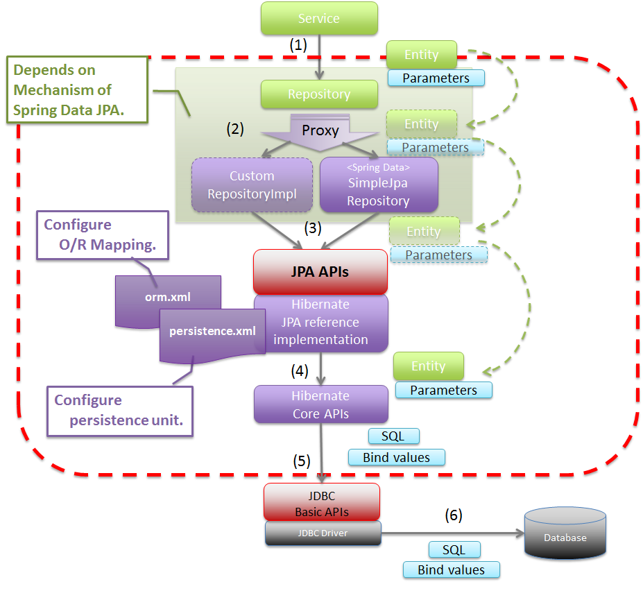
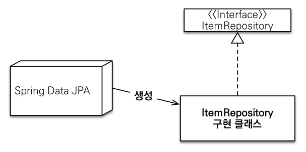

# Spring Data JPA

- [Spring Data JPA](#spring-data-jpa)
- [참조](#참조)
- [소개](#소개)
- [공통 인터페이스 기능](#공통-인터페이스-기능)
  - [순수 JPA 기반 리포지터리](#순수-jpa-기반-리포지터리)
  - [Spring Data JPA 공통 인터페이스](#spring-data-jpa-공통-인터페이스)
- [쿼리 메서드 기능](#쿼리-메서드-기능)
  - [Query Creation](#query-creation)
  - [NamedQuery](#namedquery)
  - [Spring Data repository에서 반환할 수 있는 타입](#spring-data-repository에서-반환할-수-있는-타입)
  - [페이징](#페이징)
  - [Bulk Operations](#bulk-operations)
  - [EntityGraph](#entitygraph)
  - [JPA Hint](#jpa-hint)
  - [Lock](#lock)
- [확장 기능](#확장-기능)
  - [사용자 정의 리포지터리](#사용자-정의-리포지터리)
  - [Auditing](#auditing)
  - [도메인 클래스 컨버터 (DomainClassConverter)](#도메인-클래스-컨버터-domainclassconverter)
- [🧐️Spring Data JPA 구현체(implementation) 분석](#️spring-data-jpa-구현체implementation-분석)
- [부록](#부록)
  - [Specifications](#specifications)
  - [Query by `Example`](#query-by-example)
  - [Projections](#projections)
  - [Native Query](#native-query)

# 참조

- [공식 문서](https://docs.spring.io/spring-data/jpa/docs/current/reference/)
- [실전! 스프링 데이터 JPA](https://www.inflearn.com/course/%EC%8A%A4%ED%94%84%EB%A7%81-%EB%8D%B0%EC%9D%B4%ED%84%B0-JPA-%EC%8B%A4%EC%A0%84/dashboard) - 김영한
  - [자바 ORM 표준 JPA 프로그래밍](https://www.aladin.co.kr/shop/wproduct.aspx?ISBN=9788960777330)
  - [테스트 코드](https://github.com/xpdojo/java/blob/main/spring-data-jpa)

# 소개

순수 JPA에서 반복적으로 작성했던 CRUD 등을 기본적으로 제공한다.
즉 Spring Data JPA가 자동화해주는 것들이 너무 많다.

순수 JPA를 학습하지 않은 상태에서 바로 Spring Data JPA를 사용하게 되면 기본적인 동작 방식을 알 수 없을 뿐더러
문제가 발생했을 때 근본적인 원인을 파악하기 어렵다.
🧐️ **개발할 때는 주로 Spring Data JPA를 사용하겠지만 순수 JPA를 꼼꼼하게 공부하자!**



*출처: [Basic flow of Spring Data JPA - Terasoluna](https://terasolunaorg.github.io/guideline/5.1.0.RELEASE/en/ArchitectureInDetail/DataAccessJpa.html#about-spring-data-jpa)*

# 공통 인터페이스 기능

## 순수 JPA 기반 리포지터리

- 단순 CRUD 쿼리를 반복해서 작성해야 한다.

```java
@Repository
public class MemberJpaRepository {

    @PersistenceContext
    private EntityManager em;

    public Member save(Member member) {
        em.persist(member);
        return member;
    }

    public void delete(Member member) {
        em.remove(member);
    }

    public List<Member> findAll() {
        return em
                .createQuery("select m from Member m", Member.class)
                .getResultList();
    }

    public Optional<Member> findById(Long id) {
        Member member = em.find(Member.class, id);
        return Optional.ofNullable(member);
    }

    public long count() {
        return em
                .createQuery("select count(m) from Member m", Long.class)
                .getSingleResult();
    }

    public Member find(Long id) {
        return em.find(Member.class, id);
    }

    public List<Member> findByUsernameAndAgeGreaterThan(final String username, final int age) {
        return em
                .createQuery("select m from Member m where m.username = :username and m.age > :age", Member.class)
                .setParameter("username", username)
                .setParameter("age", age)
                .getResultList();
    }
}
```

## Spring Data JPA 공통 인터페이스

```java
// Spring Boot 사용 시 @SpringBootApplication 덕분에 생략할 수 있다.
// @EnableJpaRepositories(basePackages = "com.markruler.demo.repository")
@Configuration
public class AppConfig {}
```

```java
public interface MemberRepository extends JpaRepository<Member, Long> {
    List<Member> findByUsernameAndAgeGreaterThan(String username, int age);
}
```

- `@Repository`를 생략할 수 있다. `@Indexed` 어노테이션이 붙어 있는 `org.springframework.data.repository.Repository`를 구현한 클래스는 자동으로 컴포넌트 스캔된다.
- JPA Exception을 Spirng Exception으로 변환하는 과정도 자동으로 처리한다.



- Proxy 객체
  - interface가 있을 경우, Repository interface의 프록시 객체가 만들어지는데 `getClass()`를 통해 클래스명을 출력해보면 `com.sun.proxy.$ProxyXXX`와 같은 객체가 생성된다. (JDK)
  - interface가 없을 경우, `@Repository`, `@Component`와 같은 Spring Bean은 `~$$EnhancerBySpringCGLIB$$` 접미사가 붙은 객체가 생성된다. (CGLib)

# 쿼리 메서드 기능

## Query Creation

- 메서드명으로 쿼리를 자동 생성할 수 있다.
  - `find...By`
- [공식 문서](https://docs.spring.io/spring-data/jpa/docs/current/reference/html/#jpa.query-methods.query-creation) 참조

## NamedQuery

- `@Query(name=NamedQuery)`
- JPA의 NamedQuery 기능을 사용할 수 있다.
- 실무에서는 거의 사용하지 않는다.
- `@Query`를 생략하고 메서드 이름만으로 Named Query를 호출할 수 있다.
- `@Query`는 이름 없는 NamedQuery처럼 동작한다고 생각할 수 있다. 컴파일 시 쿼리에 오류가 있다면 `QueryException`를 던질 수 있다.

    ```java
    // 엔터티가 아닌 값 조회
    @Query("select m.username from Member m")
    List<String> findUsernameList();
    ```

    ```java
    // 엔터티가 아닌 DTO 조회
    @Query("select m.username from Member m")
    List<String> findUsernameList();
    ```

## Spring Data repository에서 반환할 수 있는 타입

- [공식 문서](https://docs.spring.io/spring-data/jpa/docs/current/reference/html/#repository-query-return-types)

## 페이징

- 순수 JPA에서 페이징

    ```java
    // Repository
    public List<Member> findByPage(final int age, final int offset, final int limit) {
        return entityManager
                .createQuery("select m from Member m where m.age = :age order by m.username desc")
                .setParameter("age", age)
                .setFirstResult(offset)
                .setMaxResults(limit)
                .getResultList();
    }
    
    public long totalCount(final int age) {
        return entityManager
                .createQuery("select count(m) from Member m where m.age = :age", Long.class)
                .setParameter("age", age)
                .getSingleResult();
    
    // Service
    List<Member> members = memberJpaRepository.findByPage(age, offset, limit);
    ```

- Spring Data JPA에서 페이징
  - `Page`는 추가 count 쿼리 결과를 포함하는 페이징 기능을 제공한다.
    - count 쿼리를 별도로 선언하지 않고 offset이 들어있지 않다면, count 쿼리를 추가적으로 실행하는데 join을 한다. 성능이 매우 낮아질 수 있다.
    - JSON 형식으로 매핑된다.
  - `Slice`는 추가 count 쿼리 없이 다음 페이지만 확인 가능하다.
    - 다음 페이지 여부를 확인할 수 있다. 무한 스크롤 같은 곳에서 활용할 수 있다.
  - `List`는 추가 count 쿼리 없이 결과만 반환한다.
    - total count가 필요없을 때 사용한다.

    ```java
    // Repository
    @Query(value = "select m from Member m left join m.team t",
                countQuery = "select count(m) from Member m")
        Page<Member> findByAge(int age, Pageable pageable);
    
    // Service
    final int page = 0; // offset이 들어가지 않고 countQuery를 실행한다.
    // final int page = 1; // offset이 포함되며 countQuery를 별도로 실행하지 않는다.
    final int size = 3;
    final Sort sort = Sort.by("username").descending();
    final PageRequest pageRequest = PageRequest.of(page, size, sort);
    Page<Member> pageMember = memberRepository.findByAge(age, pageRequest);
    ```

    - `First`, `Top` 키워드 사용
      - [공식 문서](https://docs.spring.io/spring-data/jpa/docs/current/reference/html/#repositories.limit-query-result)

        ```java
        User findFirstByOrderByLastnameAsc();
        
        User findTopByOrderByAgeDesc();
        
        Page<User> queryFirst10ByLastname(String lastname, Pageable pageable);
        
        Slice<User> findTop3ByLastname(String lastname, Pageable pageable);
        
        List<User> findFirst10ByLastname(String lastname, Sort sort);
        
        List<User> findTop10ByLastname(String lastname, Pageable pageable);
        ```

## Bulk Operations

- 한번에 여러 엔터티를 수정한다면 벌크 연산이라고 한다.
- JPA를 이용한 벌크 수정 쿼리

    ```java
    public int bulkAgePlus(int age) {
        int resultCount = em.createQuery(
                    "update Member m set m.age = m.age + 1" +
                        "where m.age >= :age")
                    .setParameter("age", age)
                    .executeUpdate();
        return resultCount;
    }
    ```

- Spring Data JPA를 이용한 벌크 수정 쿼리

    ```java
    @Modifying(clearAutomatically = true)
    @Query("update Member m set m.age = m.age + 1 where m.age >= :age")
    int bulkAgePlus(@Param("age") int age);
    ```

- `@Modifying`를 사용하지 않으면 다음과 같은 예외를 던진다.

    ```java
    org.hibernate.hql.internal.QueryExecutionRequestException: Not supported for DML operations
    ```

- 영속성 컨텍스트를 거치지 않고 바로 SQL을 실행하기 때문에 영속성 컨텍스트의 엔터티 객체와 DB 엔터티가 다를 수 있다. 이 부분을 해결하려면 다음 두 가지 방법 중 하나를 시도한다.
  - 영속성 컨텍스트에 엔터티가 없는 상태에서 벌크 연산을 먼저 실행한다.
  - 부득이하게 영속성 컨텍스트에 엔터티가 있으면 벌크 연산 직후 영속성 컨텍스트를 초기화한다. (flush + clear)

## EntityGraph

- `@EntityGraph`
- 연관된 엔터티들을 Eager Loading 한다.
- Fetch Join 대신 사용할 수 있다. (N+1 문제를 해결할 수 있다)
- JPQL을 작성할 필요 없을 정도로 간단한 건 이 방법을 사용할 수 있다.

## JPA Hint

- `@QueryHints` (`@QueryHint`)
- SQL 힌트가 아니라 JPA 구현체에게 제공하는 힌트다.

```java
@QueryHints(value = {
    @QueryHint(name = "org.hibernate.readOnly", value = "true")},
                        forCounting = true)
Page<Member> findByUsername(String name, Pagable pageable);
```

## Lock

> 책 16장 참고

```java
@Lock(LockModeType.PESSIMISTIC_WRITE)
```

# 확장 기능

## 사용자 정의 리포지터리

```java
// @SpringBootApplication를 사용하면 @EnableJpaRepositories 어노테이션 생략 가능
@EnableJpaRepositories(
        basePackages = "com.markruler.datajpa.repository",
        repositoryImplementationPostfix = "Impl")
```

```java
// 사용자 정의 인터페이스
public interface MemberRepositoryCustom {
    List<Member> findMemberCustom();
}
```

```java
// 사용자 정의 인터페이스 구현 클래스
@RequiredArgsConstructor
public class MemberRepositoryImpl implements MemberRepositoryCustom {

    private final EntityManager em;

    @Override
    public List<Member> findMemberCustom() {
        return em
                        .createQuery("select m from Member m")
                        .getResultList();
    }
}
```

```java
// 사용자 정의 인터페이스 상속
public interface MemberRepository
    extends JpaRepository<Member, Long>, MemberRepositoryCustom {
}
```

- 실무에서는 주로 Querydsl이나 SpringJdbcTemplate을 함께 사용할 때 사용자 정의 리포지터리 기능을 사용한다.
- Repository 인터페이스가 아닌 클래스를 만들고 `@Repository` 어노테이션과 함께 빈으로 사용해서 직접 구현해도 된다. 이 경우 Spring Data JPA와는 관계없이 별도로 동작한다.

## Auditing

엔터티를 생성하고 변경할 때 변경한 사람과 일시를 추적할 수 있는 데이터를 주입한다. 실무에서 대부분의 엔터티는 등록시간과 수정시간이 필요하지만, 등록자와 수정자는 필요 없을 수도 있다. 그래서 Time을 포함한 BaseEntity를 상속해서 부모로 두고 등록자와 수정자를 넣어서 Auditing을 위한 Entity를 만든다.

```java
@EntityListeners(AuditingEntityListener.class)
@MappedSuperclass
@Getter
public class AuditTimeEntity {

    @CreatedDate
    @Column(updatable = false)
    private LocalDateTime createdAt;

    @LastModifiedDate
    private LocalDateTime updatedAt;
}

@EntityListeners(AuditingEntityListener.class)
@MappedSuperclass
@Getter
public class AuditEntity extends AuditTimeEntity { // Base Entity

    @CreatedBy
    @Column(updatable = false)
    private String createdBy;

    @LastModifiedBy
    private String updatedBy;
}

// 생성 및 변경한 '사람'을 관리해주는 `AuditorAware`를 빈으로 등록한다.
@Bean
public AuditorAware<String> auditorProvider() {
    // 실무에서는 세션 정보나 스프링 시큐리티 Principal, 사용자의 ID 등을 사용한다.
    return () -> Optional.of(UUID.randomUUID().toString());
}
```

참고로 최초 생성 시점에 수정 데이터는 제외하고 저장 데이터만 입력하고 싶다면 `@EnableJpaAuditing(modifyOnCreate = false)` 옵션을 사용한다.

## 도메인 클래스 컨버터 (DomainClassConverter)

도메인 클래스 컨버터도 리파지토리를 사용해서 엔터티를 찾는다. 다만 이 엔터티는 단순 조회용으로만 사용해야 한다. 트랜잭션이 없는 범위에서 엔터티를 조회했으므로, 엔터티를 변경해도 DB에 반영되지 않는다.

```java
@GetMapping("/members/{id}")
public String findMember(@PathVariable("id") Long id) {
    Member member = memberRepository.findById(id).get();
    return member.getUsername();
}

@GetMapping("/members/{id}")
public String findMember(@PathVariable("id") Member member) { // Converting Domain Class
    return member.getUsername();
}
```

# 🧐️Spring Data JPA 구현체(implementation) 분석

- Spring Data JPA가 제공하는 공통 인터페이스의 구현체는 `org.springframework.data.jpa.repository.support.SimpleJpaRepository`이다. `save()`, `findAll()` 등의 메서드 구현체가 들어있다.
- `@Repository`를 적용하면 'JPA Exception'를 '스프링이 추상화한 Exception'으로 변환해준다.
- Service에서 트랜잭션을 시작하면 Repository는 해당 트랜잭션을 전파(propagation) 받아서 사용한다.
- `@Transactional`을 적용하면 Entity Transaction을 관리할 수 있다. JPA의 모든 변경은 이 트랜잭션 안에서 동작한다. Spring Data JPA는 변경(등록, 수정, 삭제) 메서드를 트랜잭션에서 처리한다. Service 레이어에서 트랜잭션을 시작하지 않으면 Repository 레이어에서 트랜잭션을 시작한다. SimpleJpaRepository의 변경 메서드들을 보면 `@Transactional`이 적용되어 있는 것을 확인할 수 있다. (그래서 Service에 `@Transactional`이 없어도 데이터를 변경할 수 있는 것이다)

    ```java
    // org.springframework.data.jpa.repository.support.SimpleJpaRepository#delete(T entity)
    @Override
    @Transactional
    @SuppressWarnings("unchecked")
    public void delete(T entity) {
        ...
    }
    ```

- `readOnly = true`는 데이터를 단순히 조회만 하고 변경하지 않는다. Dirty Checking과 Flush를 생략하기 때문에 성능을 약간 높일 수 있지만, 성능이 중요한 곳이 아니면 큰 영향은 없다.
- `save()` 메서드는 새로운 엔터티면 저장(persist)하고, 아니면 병합(merge)한다.

    ```java
    // org.springframework.data.jpa.repository.support.SimpleJpaRepository#save(S entity)
    @Transactional
    @Override
    public <S extends T> S save(S entity) {
    
        Assert.notNull(entity, "Entity must not be null.");
    
        if (entityInformation.isNew(entity)) {
            em.persist(entity);
            return entity;
        } else {
            return em.merge(entity);
        }
    }
    ```

  - 새로운 엔터티인지 판단하는 `isNew()` 메서드는 식별자가 Object라면 null 체크를 하고 Number라면 0인지 확인한다. `Persistable` 인터페이스를 구현해서 `isNew()` 메서드는 재정의할 수 있다.

    ```java
    // org.springframework.data.mapping.model.PersistentEntityIsNewStrategy#isNew(Object entity)
    @Override
    public boolean isNew(Object entity) {

        Object value = valueLookup.apply(entity);

        if (value == null) {
            return true;
        }

        if (valueType != null && !valueType.isPrimitive()) {
            return false;
        }

        if (value instanceof Number) {
            return ((Number) value).longValue() == 0;
        }

        throw new IllegalArgumentException(
                String.format("Could not determine whether %s is new! Unsupported identifier or version property!", entity));
    }
    ```

    - JPA 식별자(identity) 생성 전략이 `@GeneratedValue`라면 `save()` 호출 시점에 식별자가 없으므로 새로운 Entity로 인식해서 정상적으로 동작한다. 하지만 `@Id` 어노테이션만 적용하고 식별자는 직접 할당하는 전략이라면 이미 식별자 값이 있는 상태로 `save()` 함수를 호출하기 때문에 `merge()`가 호출된다. merge는 우선 DB를 호출해서 값을 확인하고, 값이 없으면 새로운 엔터티로 인지하므로 매우 비효율적이다. 따라서 `Persistable`을 사용해서 새로운 엔터티 확인 여부를 직접 구현한다. 저자(김영한)는 등록 시간(`@CreatedDate`)에 값이 없으면(null이라면) 새로운 엔터티로 판단하도록 구현해서 사용한다.

# 부록

실무에서 사용 빈도가 낮은 기술들을 정리한다.

## Specifications

- JPA Criteria를 활용해서 DDD의 `SPECIFICATION` 개념을 활용할 수 있다.
- **실무에서는 Querydsl을 사용하자.**
- 술어(predicate)는 AND, OR 같은 논리 연산자로 조합(composite)해서 다양한 검색 조건을 쉽게 생성할 수 있다.

```java
// org.springframework.data.jpa.repository.JpaSpecificationExecutor<T>
public interface JpaSpecificationExecutor<T> {
    Optional<T> findOne(@Nullable Specification<T> spec);
    List<T> findAll(@Nullable Specification<T> spec);
    Page<T> findAll(@Nullable Specification<T> spec, Pageable pageable);
    List<T> findAll(@Nullable Specification<T> spec, Sort sort);
    long count(@Nullable Specification<T> spec);
}
```

## Query by `Example`

- `org.springframework.data.domain.Example`
- JpaRepository는 기본적으로 `org.springframework.data.repository.query.QueryByExampleExecutor`을 상속한다.
- 필드에 데이터가 있는 실제 도메인 객체 Probe를 인자로 입력해서 동적 쿼리를 생성한다.

```java
Member member = new Member("m1"); // Probe
Example<Member> example = Example.of(member);
List<Member> result = memberRepository.findAll(example);
```

- Inner Join은 가능하지만 Left Outer Join을 할 수 없다.
  - 그럼 Right Outer Join이나 이 외의 Join은 될까?
- **실무에서는 Querydsl을 사용하자.**

## Projections

- [공식 문서](https://docs.spring.io/spring-data/r2dbc/docs/current/reference/html/#projections)
  - Interface-based Projections
    - Closed Projection
    - Open Projection
  - Class-based Proejections (DTOs)
    - Dynamic Projection
- Projection을 위한 interface는 프록시 객체가 생성된다. 반대로 Projection을 위한 class는 프록시 없이 그대로 객체가 만들어진다.
- Projection 대상이 ROOT 엔터티라면 JPQL Select 기능을 최적화할 수 있다.
  - ROOT 엔터티가 아니면 Left Outer Join을 수행하고 모든 필드를 엔터티로 조회해서 계산한다.
  - **단순할 때는 사용할 수 있지만, 조금이라도 복잡해지면 Querydsl을 사용하자.**

```java
/*
    select
        member0_.username as col_0_0_,
        team1_.team_id as col_1_0_,
        team1_.team_id as team_id1_2_,
        team1_.name as name2_2_ 
    from
        member member0_ 
    left outer join
        team team1_ 
            on member0_.team_id=team1_.team_id 
    where
        member0_.username=?
 */
public interface NestedClosedProjection {

    String getUsername();

    TeamInfo getTeam();

    interface TeamInfo {
        String getName();
    }
}
```

## Native Query

- 가급적 네이티브 쿼리는 사용하지 않는다. 정말 어쩔 수 없을 때 사용한다.
- 차라리 JdbcTemplate 혹은 MyBatis를 사용한다. JPA와 같이 조합해서 사용할 수 있다. 그런데 이것도 거의 쓸 일이 없다.
- 제약
  - 반환 타입은 `Object[]`, `Tuple`, `DTO` 등 많지 않다. DTO는 늦게 지원되기 시작했는데 Interface-based Projection과 조합해서 활용할 수 있다.
  - Sort 파라미터를 통한 정렬이 정상적으로 동작하지 않을 수도 있다.
  - JPQL처럼 애플리케이션 로딩 시점에 문법을 확인할 수 없다.
  - 동적 쿼리를 만들 수 없다.
- Hibernate를 직접 활용해서 Dynamic Native Query를 작성하는 방법도 있다.
  - 하지만 차라리 스프링의 **JdbcTemplate(우선)**, MyBatis, jOOQ 같은 외부 라이브러리를 권장한다.
