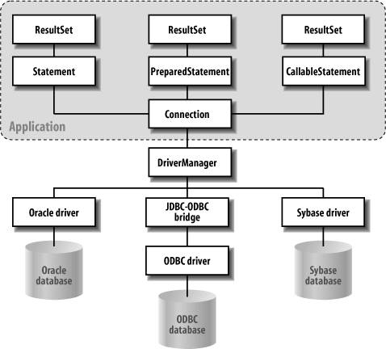
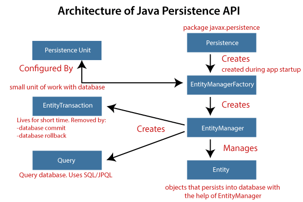

# Persistence API

- [Persistence API](#persistence-api)
- [참조](#참조)
- [JDBC: Java Database Connectivity](#jdbc-java-database-connectivity)
  - [DataSource](#datasource)
- [JPA (Java Persistence API)](#jpa-java-persistence-api)
- [Spring Data JPA](#spring-data-jpa)

# 참조

- [Java SE 8 JDBC API](https://docs.oracle.com/javase/8/docs/technotes/guides/jdbc/) - Oracle Docs
- [Hibernate ORM 5.4.30.Final User Guide](https://docs.jboss.org/hibernate/orm/5.4/userguide/html_single/Hibernate_User_Guide.html#pc)
- [자바 ORM 표준 JPA 프로그래밍, 2015](https://www.aladin.co.kr/shop/wproduct.aspx?isbn=9788960777330) - 김영한
  - [자바 ORM 표준 JPA 프로그래밍 - 기본편](https://www.inflearn.com/course/ORM-JPA-Basic) - 김영한
  - [실전! 스프링 부트와 JPA 활용1 - 웹 애플리케이션 개발](https://www.inflearn.com/course/%EC%8A%A4%ED%94%84%EB%A7%81%EB%B6%80%ED%8A%B8-JPA-%ED%99%9C%EC%9A%A9-1) - 김영한
  - [실전! 스프링 부트와 JPA 활용2 - API 개발과 성능 최적화](https://www.inflearn.com/course/%EC%8A%A4%ED%94%84%EB%A7%81%EB%B6%80%ED%8A%B8-JPA-API%EA%B0%9C%EB%B0%9C-%EC%84%B1%EB%8A%A5%EC%B5%9C%EC%A0%81%ED%99%94) - 김영한
  - [실전! 스프링 데이터 JPA](https://www.inflearn.com/course/%EC%8A%A4%ED%94%84%EB%A7%81-%EB%8D%B0%EC%9D%B4%ED%84%B0-JPA-%EC%8B%A4%EC%A0%84) - 김영한
  - [실전! Querydsl](https://www.inflearn.com/course/Querydsl-%EC%8B%A4%EC%A0%84) - 김영한
- [JPA 프로그래밍 입문, 2017](https://www.aladin.co.kr/shop/wproduct.aspx?isbn=9788980782901) - 최범균
- [JPA 퀵스타트, 2020](https://www.aladin.co.kr/shop/wproduct.aspx?isbn=9791186710586) - 채규태

# JDBC: Java Database Connectivity

_출처: JDBC-database Interaction - [Java Enterprise in a Nutshell](https://flylib.com/books/en/2.177.1.75/1/)_

_출처: [TERASOLUNA Server Framework Guideline](https://terasolunaorg.github.io/guideline/5.1.1.RELEASE/en/ArchitectureInDetail/DataAccessJpa.html) - [GitHub](https://github.com/terasolunaorg/terasolunaorg.github.com)_

JDBC는 `javax.sql`와 `java.sql` 2가지 패키지로 구성된다.
[API - GitHub](https://github.com/openjdk/jdk/tree/master/src/java.sql/share/classes)

DBMS 벤더와 상관 없이 JDBC API를 사용해서 데이터에 접근할 수 있다.
DBMS를 변경해야 할 경우, 해당하는 JDBC 드라이버로 교체만 하면 애플리케이션의 기존 소스 코드를 그대로 사용할 수 있다.

## [DataSource](https://docs.oracle.com/javase/8/docs/api/javax/sql/DataSource.html)

DB Connection 정보를 갖는 인터페이스다.

기존에 `DriverManager`를 통해서 얻어내는 `Connection` 인스턴스는 데이터베이스와 실질적인 접속을 의미한다.
따라서 `Connection.close()` 메소드를 수행하면 데이터베이스와의 접속이 끊긴다.

`DataSource`를 통해서 얻어내는 `Connection`은 실질적인 접속이 아니라 논리적인 접속이다.
커넥션 풀에 있는 실질적인 데이터베이스 커넥션에 대응될 뿐이므로 `DataSource`를 통해서 얻는
`Connection` 인스턴스를 `close()` 메소드로 종료하면 실질적인 접속이 끊기는 것이 아니라,
`Connection`에 할당된 실질적인 커넥션과의 논리적인 연결이 해제가 된다는 말이다.

# JPA (Java Persistence API)

*출처: [Spring Boot JPA - javatpoint](https://www.javatpoint.com/spring-boot-jpa)*

- [JPA](1-orm-jpa-basic.md)
- [JPQL](2-jpql.md)

# Spring Data JPA

- [요약](3-spring-data-jpa.md)
