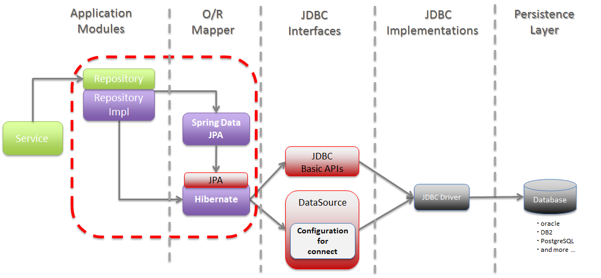
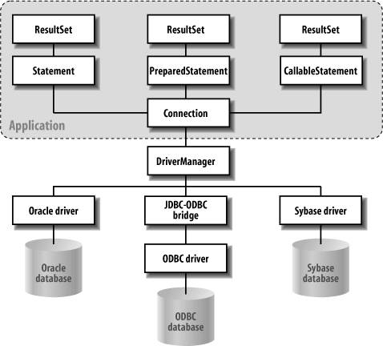
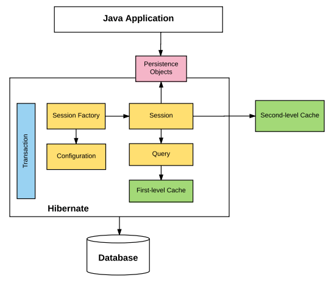

# Persistence API

- [Persistence API](#persistence-api)
  - [JDBC: Java Database Connectivity](#jdbc-java-database-connectivity)
  - [DataSource](#datasource)
  - [JPA: Java Persistence API](#jpa-java-persistence-api)
    - [JPA 구현체 예: Hibernate](#jpa-구현체-예-hibernate)
    - [왜 JPA를 사용해야 하는가?](#왜-jpa를-사용해야-하는가)
    - [주요 API](#주요-api)
      - [엔터티의 생명주기](#엔터티의-생명주기)
      - [퍼시스턴스 컨텍스트의 특징](#퍼시스턴스-컨텍스트의-특징)
  - [이슈](#이슈)
  - [참고 자료](#참고-자료)

_출처: [TERASOLUNA Server Framework Guideline](https://terasolunaorg.github.io/guideline/5.1.1.RELEASE/en/ArchitectureInDetail/DataAccessJpa.html) - [GitHub](https://github.com/terasolunaorg/terasolunaorg.github.com)_

## JDBC: Java Database Connectivity

_출처: JDBC-database Interaction - [Java Enterprise in a Nutshell](https://flylib.com/books/en/2.177.1.75/1/)_

> JDBC는 `javax.sql`와 `java.sql` 2가지 패키지로 구성됩니다.
> [API - GitHub](https://github.com/openjdk/jdk/tree/master/src/java.sql/share/classes)

- DBMS 벤더와 상관 없이 JDBC API를 사용해서 데이터에 접근할 수 있습니다.
- DBMS를 변경해야 할 경우, 해당하는 JDBC 드라이버로 교체만 하면 애플리케이션의 기존 소스 코드를 그대로 사용할 수 있습니다.

## DataSource

## JPA: Java Persistence API

_출처: [Java Persistence API Architecture](http://openjpa.apache.org/builds/1.2.1/apache-openjpa-1.2.1/docs/manual/jpa_overview_arch.html) - Apache OpenJPA User's Guide_

- JPA는 자바 진영의 ORM 기술 표준입니다.
  여기서 ORM(Object-Relational Mapping)이란 이름 그대로 Object와 관계형 데이터베이스를 매핑한다는 뜻입니다.
- ORM 프레임워크는 객체와 테이블을 매핑해서 패러다임의 불일치 문제를 개발자 대신 해결해줍니다.
  예를 들어 ORM 프레임워크를 사용하면 객체를 데이터베이스에 저장할 때 SQL을 직접 작성하는 것이 아니라
  객체를 마치 자바 컬렉션에 저장하듯이 ORM 프레임워크에 저장하면 됩니다.
  그러면 ORM 프레임워크가 적절한 SQL을 생성해서 데이터베이스 객체를 저장해줍니다.
- 객체 측면에서는 정교한 객체 모델링을 할 수 있고, RDB는 데이터베이스에 맞도록 모델링하면 됩니다.
  그리고 둘을 어떻게 매핑해야 하는지 ORM 프레임워크에게 알려주면 됩니다.
  덕분에 개발자는 데이터 중심은 관계형 데이터베이스를 사용해도 객체지향 애플리케이션 개발에 집중할 수 있게 됩니다.
- OOP 언어에는 대부분 ORM 프레임워크들이 있는 성숙도에 따라 단순히 CRUD하는 정도의 기능만 제공하는 것부터
  패러다임 불일치 문제를 대부분 해결해주는 ORM 프레임워크도 있습니다.
  자바 진영에서도 다양한 프레임워크가 있는데 그 중
  하이버네이트(Hibernate)는 대부분의 패러다임 불일치 문제를 해결해주는 성숙한 ORM 프레임워크입니다.

### JPA 구현체 예: Hibernate

_출처: [Hibernate Architecture](https://howtodoinjava.com/hibernate-tutorials/) - HowToDoInJava_

### 왜 JPA를 사용해야 하는가?

- 개발자가 반복적인 코드와 SQL을 추가로 작성하지 않아도 되기 때문에 **생산성**이 향상됩니다.
- 엔터티 필드가 추가되면 SQL도 수정해야 하지만 JPA를 사용하면 JPA가 대신 처리해주므로 **유지보수**해야 하는 코드 수가 줄어듭니다.
- **패러다임의 불일치를 해결**해서 개발자가 객체지향 프로그래밍에 집중할 수 있게 해줍니다.
- 1차 캐시를 사용한다거나 SQL 힌트 기능을 통해 **성능**을 보장합니다.
- 애플리케이션이 특정 RDBMS 벤더에 종속되지 않도록 데이터 접근 추상화 계층(Dialect)을 제공해서 **독립성**을 보장합니다.
- JPA는 자바 진영의 ORM 기술 **표준**입니다. 표준을 사용하면 다른 구현 기술로 손쉽게 변경할 수 있습니다.

### 주요 API

- 엔터티 매니저(Entity Manager)는 CRUD 포함해 엔터티와 관련된 모든 일을 처리하는 관리자입니다.
- 퍼시스턴스 컨텍스트(Persistence Context)란 엔터티를 영구 저장하는 환경을 말합니다.
  - 예를 들면, 엔터티 매니저는 `persist()` 메서드를 사용해 엔터티를 퍼시스턴스 컨텍스트에 저장합니다.

#### 엔터티의 생명주기

- 비영속(new/transient)
  - 퍼시스턴스 컨텍스트와 전혀 관계가 없는 상태
- 영속(managed)
  - `em.persist(entity)`
  - 퍼시스턴스 컨텍스트에 저장된 상태
- 준영속(detached)
  - `em.detach(entity)`
  - 퍼시스턴스 컨텍스트에 저장되었다가 분리된 상태
- 삭제(removed)
  - `em.remove(entity)`
  - 삭제된 상태

#### 퍼시스턴스 컨텍스트의 특징

- 퍼시스턴스 컨텍스트는 엔터티를 식별자 값(@Id)으로 구분하기 때문에 영속 상태는 식별자 값이 반드시 있어야 한다.
- JPA는 보통 트랜잭션을 커밋하는 순간 퍼시스턴스 컨텍스트에 새로 저장된 엔터티를 데이터베이스에 반영하는데 이를 플러시(flush)라 한다.
- 장점
  - 1차 캐시
  - 동일성 보장
  - 트랜잭션을 지원하는 쓰기 지연
  - 변경 감지
  - 지연 로딩

## 이슈

TODO: 정리

## 참고 자료

- [Java SE 8 JDBC API](https://docs.oracle.com/javase/8/docs/technotes/guides/jdbc/) - Oracle Docs
- [자바 ORM 표준 JPA 프로그래밍](https://www.aladin.co.kr/shop/wproduct.aspx?isbn=9788960777330) - 김영한
- [Hibernate ORM 5.4.30.Final User Guide](https://docs.jboss.org/hibernate/orm/5.4/userguide/html_single/Hibernate_User_Guide.html#pc)
