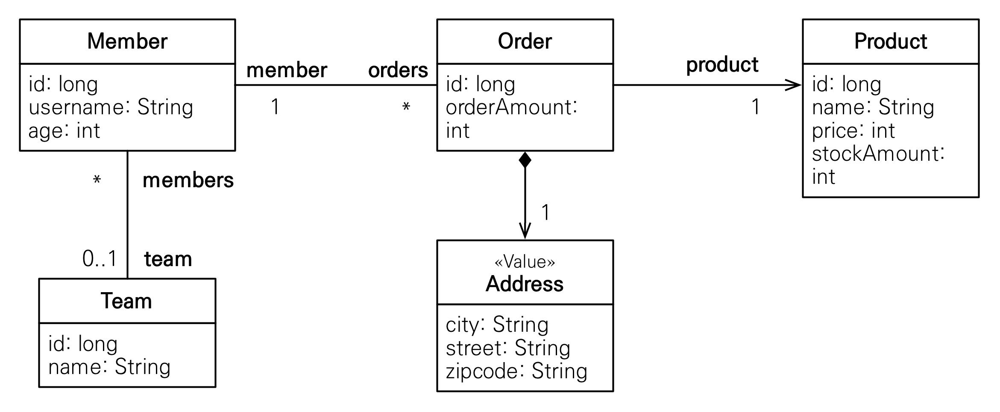

# JPQL 훈련

## 예제

- [김영한님 강의 실전 예제](https://github.com/holyeye/jpabook)

```bash
# H2 Database
sudo docker run -d \
  -p 1521:1521 \
  -p 81:81 \
  -v /home/data/h2-data:/opt/h2-data \
  -e H2_OPTIONS="-ifNotExists" \
  --name=local-h2 \
  markruler/h2:1.4.200

curl localhost:81
```

| 저장소    | URL                               |
| --------- | --------------------------------- |
| 영속 볼륨 | jdbc:h2:tcp://localhost:1521/test |
| 메모리 DB | jdbc:h2:mem:testdb                |

## 실행

```bash
$ mvn clean test
```

## 예제 모델


